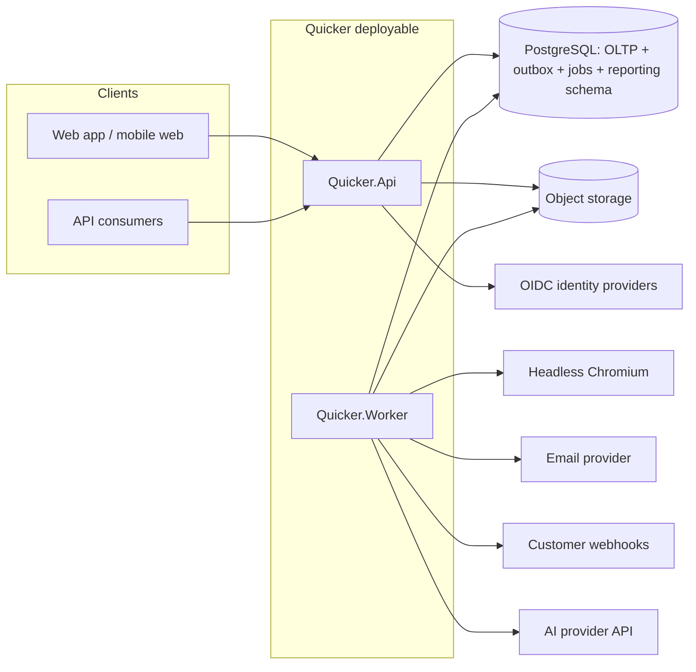
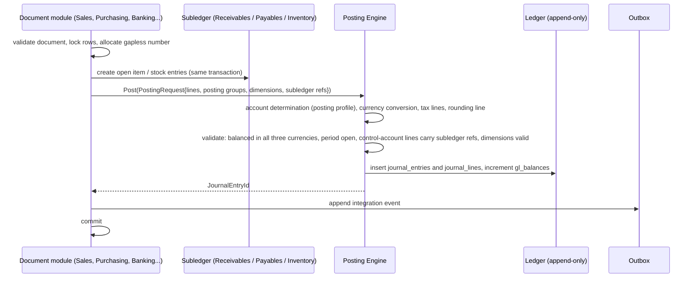

# Quicker ERP: Architecture

This document is the map. Each major decision has an Architecture Decision Record in `docs/adr/` with alternatives and reasoning; this file states what we build and how the pieces fit. Read it with `DOMAIN_MODEL.md` (data), `POSTING_RULES.md` (accounting behaviour) and `ROADMAP.md` (order of work).

## 1. Principles that shape everything

1. **Financial consistency is synchronous; everything else is eventual.** A business document is posted in one database transaction that writes the document state, the journal entry, the subledger open item or stock value entries, the balance increments and the outbox message. Projections, notifications, webhooks, search indexing and reporting fact tables are fed from the outbox afterwards. Nothing that affects the trial balance, a subledger or stock valuation is ever "eventually" consistent.
2. **One way in to the ledger.** Only the Posting Engine writes journal entries. Modules describe *what happened* (a `PostingRequest` with amounts, posting groups, dimensions and subledger references); the engine decides *which accounts* (account determination) and guarantees balance, currency conversion, period validity and immutability.
3. **Append-only truth, derived speed.** Journal lines, stock quantity entries, stock value entries and audit events are never updated or deleted (enforced in the database). Balances, on-hand quantities, average costs and reporting facts are derived, maintained incrementally in the same transaction, and rebuildable from the append-only tables by a deterministic routine that CI runs and compares.
4. **Tenant, company, branch are columns, not deployments.** Every tenant-scoped table carries `tenant_id`; most carry `company_id`; operational documents carry `branch_id` and `warehouse_id`. Row-level security in PostgreSQL enforces the tenant boundary below the application; permissions enforce company/branch/warehouse scope in the application.
5. **Modular monolith with hard walls.** One deployable, many modules. Modules expose a `Contracts` project (DTOs, interfaces, events) and hide everything else. Architecture tests fail the build on any reference that crosses a wall.
6. **Explainability is a data requirement.** Prices, costs, taxes, blocks and balances persist their explanation (a structured breakdown) at the moment they are computed, so the "why" shown later is the "why" that actually applied.
7. **Boring core, creative edges.** PostgreSQL, .NET, React. No broker, no cache cluster, no second database until a measurement demands it.

## 2. Stack summary

| Layer | Choice | ADR |
|-------|--------|-----|
| Language / runtime | C# 14 on .NET 10 LTS | ADR-0002 |
| Web framework | ASP.NET Core minimal APIs; OpenAPI 3.1 generated at build; NSwag-generated TypeScript client | ADR-0002, ADR-0012 |
| Database | PostgreSQL 17 (18 once validated); Npgsql | ADR-0003 |
| Data access | EF Core 10 for aggregates and change tracking; Dapper/raw SQL for ledgers, balances and reporting | ADR-0003 |
| Migrations | Forward-only SQL migrations (DbUp) in `db/migrations`; CI proves the EF model matches the schema | ADR-0003 |
| Background work | In-process hosted workers pulling from PostgreSQL tables (`outbox_messages`, `jobs`) with `SKIP LOCKED` | ADR-0010 |
| Object storage | S3 API (MinIO locally; any S3-compatible service in production) | ADR-0024 |
| PDF | HTML/CSS templates (Scriban) rendered by headless Chromium (Playwright) in the worker | ADR-0022 |
| Front end | React 19, TypeScript, Vite, TanStack Router/Query/Table/Virtual/Form, Radix primitives, Tailwind v4 with design tokens, i18next + ICU, ECharts | ADR-0013 |
| Auth | Built-in identity (Argon2id, TOTP, WebAuthn) + OIDC federation; JWT access tokens (10 min) + rotating refresh tokens | ADR-0014 |
| Testing | xUnit, FsCheck (property tests), Testcontainers (real PostgreSQL), architecture tests by reflection (boundaries), Playwright (e2e), Vitest + Testing Library, axe (a11y), k6 (load) | ADR-0029 |
| Observability | OpenTelemetry traces/metrics/logs, Serilog structured logs, health endpoints | ADR-0025 |
| Delivery | Docker images; Docker Compose for local and on-premise; Helm chart for Kubernetes SaaS; GitHub Actions CI | ADR-0024 |

## 3. Repository layout (monorepo)

```
/                       root: README.md, CLAUDE.md, Quicker.sln, package.json (pnpm workspace), docker-compose.yml, Makefile
/docs                   this blueprint, ADRs, PROGRESS.md, user/admin docs (M10)
/db/migrations          V0001__....sql ... (forward-only), /db/seed (reference data: currencies, countries, UoM, tax templates, CoA templates)
/src/Kernel             Quicker.Kernel: Money, Quantity, Ids, Clock, Result, TenantContext, domain event base types, rounding policies
/src/BuildingBlocks     Quicker.Persistence (EF conventions, RLS context, outbox), Quicker.Web (API conventions, problem details, idempotency), Quicker.Testing
/src/Modules/<Name>     one folder per module, each with:
                          <Name>.Contracts   public DTOs, interfaces, integration events (the only thing other modules may reference)
                          <Name>             domain + application + infrastructure (internal)
                          <Name>.Tests       unit and integration tests for the module
/src/Host/Quicker.Api   composition root for the HTTP API
/src/Host/Quicker.Worker composition root for background workers (outbox dispatch, jobs, schedules, PDF)
/src/Host/Quicker.Migrator runs migrations and seeds, builds the demo tenant, and carries the maintenance commands (backup, restore, verify, rebuild-balances, operator)
/apps/web               React application (desktop and mobile web, including the scanning app)
/packages/ui            design system (tokens, components, Storybook)
/packages/api-client    generated TypeScript client from OpenAPI
/tests/Scenarios        end-to-end "hard scenario" suite (API-level, real database)
/tests/Invariants       accounting invariant harness shared by all suites
/tests/Load             k6 scripts
/tests/E2E              Playwright browser tests
/deploy                 compose files, Helm chart, environment templates
/tools                  dev scripts, seeders, code generators
/legacy/lifeos          the pre-existing Life OS app, moved in M1 pending Q2
```

## 4. Runtime topology



* `Quicker.Api` and `Quicker.Worker` are the same code with different composition roots; a single-node on-premise install can run both in one process.
* Horizontal scale: API instances are stateless; workers coordinate through `SKIP LOCKED` row claims. PostgreSQL scales up first (the boring path), then read replicas for reporting.
* Dedicated-database tenants are routed by a tenant catalog in the control-plane schema; the same binaries serve both tiers.

## 5. Multi-tenancy model (ADR-0004)

* **Control plane** schema `control`: tenants, users (global identities), tenant memberships, subscription plans, feature flags, tenant database routing. Not subject to tenant RLS.
* **Tenant data** schema `app`: every table has `tenant_id uuid not null`, an RLS policy `tenant_id = current_setting('app.tenant_id')::uuid`, and `FORCE ROW LEVEL SECURITY`. The application connects as a non-owner role so RLS cannot be bypassed. Every unit of work begins with `SET LOCAL app.tenant_id = ...` derived from the authenticated principal; background jobs carry the tenant id in their payload and set it the same way.
* **Tiers:** shared database (default), dedicated database (large, regulated or on-premise tenants). Identical schema; the routing layer picks the connection string.
* **Proof:** a schema test asserts every `app` table has `tenant_id`, an RLS policy and forced RLS; an isolation test writes two tenants' data into every table and proves cross-tenant queries return nothing under each context; API tests attempt cross-tenant access by id and expect 404; export, search and report tests run under the wrong tenant context and expect empty results. This is hard scenario 18 and runs on every CI build.

## 6. Module map and boundaries (ADR-0001)

```mermaid
flowchart TB
  subgraph platform [Platform modules]
    Tenancy
    Identity
    Audit
    Numbering
    CustomFields
    Collaboration[Collaboration: attachments, comments, activity, notifications]
    Integration[Integration: webhooks, import/export, API keys]
    Jobs
    Search
  end
  subgraph core [Core business modules]
    Organization[Organization: companies, branches, fiscal calendars, currencies and rates, dimensions, UoM]
    Accounting[Accounting: Ledger + Posting Engine + periods + posting profiles]
    Partners
    Items
    Inventory
    Tax
  end
  subgraph flows [Process modules]
    Sales
    Purchasing
    Receivables
    Payables
    Banking[Banking: payments, statements, reconciliation, cheques, petty cash, expense claims]
    FixedAssets
    Budgeting
    Intercompany[Intercompany and Consolidation]
    Closing[Closing: checklists, FX revaluation, year-end]
    Workflow
  end
  subgraph edge [Experience modules]
    Reporting[Reporting: semantic layer, report builder, financial designer, dashboards, print, schedules]
    Onboarding[Onboarding: setup wizard, industry templates, migration toolkit]
    Intelligence[Intelligence: AI layer]
  end
  flows --> core
  core --> platform
  edge --> flows
  edge --> core
```



Rules enforced by the architecture tests (`tests/Architecture`: reflection over the project files and the compiled assemblies; the ADR-0001 amendment names the deliberate exceptions to rule 4; rule 5 waits for the Reporting module):

1. A module may reference only `Quicker.Kernel`, the building blocks and other modules' `.Contracts` projects.
2. `Accounting.Ledger` write operations are `internal`; the only public entry is `IPostingService` in `Accounting.Contracts`. No other module can create a journal entry.
3. Contracts may not reference EF Core or any persistence type.
4. Cycles between modules are forbidden. Where two modules need each other (Sales and Receivables, Purchasing and Payables, Inventory and Accounting) the dependency points from process to core, and the reverse direction is an integration event handled by the outbox.
5. Reporting reads through the `reporting` schema and each module's read contracts, never through another module's internals.

### Communication patterns

| Need | Pattern | Example |
|------|---------|---------|
| Financial effect of a document | Synchronous call to `IPostingService.Post(PostingRequest)` in the caller's transaction | Sales invoice posting |
| Subledger open item | Synchronous call to `IReceivables.OpenItem(...)` / `IPayables.OpenItem(...)` in the same transaction; the posting request carries the open item id so the engine can validate control-account lines | Invoice, receipt, credit note |
| Stock movement and cost | Synchronous call to `IInventoryPosting.Post(StockPostingRequest)`; it writes quantity and value entries and calls `IPostingService` for the GL side | Shipment, receipt, adjustment |
| Reaction that must not block or that lives in another module | Integration event via outbox, at-least-once, idempotent handler | `SalesInvoicePosted` → commission accrual, webhook, search index, fact table |
| Long-running work | Job row in `jobs` (queued with tenant, priority, idempotency key) executed by the worker | Cost adjustment over many entries, statement import, report export |
| Cross-module query | Read contract (`I<Module>Reader`) returning DTOs, or a reporting view | Customer 360 screen composes Sales, Receivables, Collaboration readers |

## 7. The posting pipeline (ADR-0006, ADR-0007)



Account determination: a `PostingRequest` line names an **account role** (for example `Revenue`, `InventoryAsset`, `ReceivablesControl`, `OutputTax`) plus the keys that select the concrete account: company, document type, item posting group, partner posting group, tax code, warehouse, branch. The **posting profile** resolves the role and keys to an account with a most-specific-wins rule, and the resolved profile version is stored on the journal line for auditability. Admins configure profiles in the UI; the engine refuses to post if a role cannot be resolved (rather than falling back silently).

## 8. Stock and costing pipeline (ADR-0008)

* **Quantity entries** (`stock_ledger_entries`) record what moved, where, when and in what lot/serial, in the item's base unit.
* **Value entries** (`stock_value_entries`) record what it cost, and are the only source of inventory GL postings. A quantity entry has one or more value entries: the initial cost, then invoice price corrections, landed costs and cost adjustments.
* **Applications** link each outbound quantity entry to the inbound entries it consumed (FIFO), or to the daily average cost bucket (average). A backdated entry re-applies from its date forward and the difference is posted as new value entries with GL adjustment lines that reference the triggering document (hard scenarios 1 and 2).
* On-hand, reserved and available quantities are maintained per (item, variant, warehouse, bin, lot, serial) under row locks (hard scenario 4). Inventory valuation at any date = sum of value entries with `posting_date` ≤ date; the GL inventory balance at that date must equal it (hard scenario 15), and an invariant test says so after every scenario.

## 9. Security architecture (ADR-0014, ADR-0015, ADR-0025)

* Authentication: built-in accounts (Argon2id, breached-password check, TOTP and WebAuthn MFA, MFA enforced per tenant policy) and OIDC federation. Access tokens are short-lived JWTs bound to a tenant; refresh tokens rotate and are revocable; API keys are hashed and scoped.
* Authorization: permissions are `module.entity.action` strings assigned to roles; role assignments carry record scopes (company, branch, warehouse); field-level rules mask or block fields per role; document-type rules limit which document types a role may create, approve or post. Segregation-of-duties rules flag conflicting combinations on save and in a standing report.
* Row-level security enforces tenancy in the database; the application enforces company/branch/warehouse scope in query filters and command validation, and reporting applies the same predicates.
* Audit: every create, update, state change, approval, override, login and permission change writes an immutable audit event with before/after values and a hash chain.
* Secrets in environment or a secrets manager; encryption in transit (TLS 1.2+) and at rest (volume encryption plus column encryption for bank account numbers, API keys and identity secrets); dependency and container scanning in CI; OWASP ASVS Level 2 checklist tracked in M10.

## 10. Reporting architecture (ADR-0021)

* A `reporting` schema in the same PostgreSQL database holds star-schema fact tables (`fact_journal_lines`, `fact_sales_lines`, `fact_purchase_lines`, `fact_stock_value`, `fact_open_items_daily`, ...) and conformed dimensions, maintained by outbox projections within seconds of posting.
* The **semantic layer** is a catalogue of models (dimensions, measures, joins, drill paths, row-level security predicates) defined in code and extended by admins. A query compiler turns a user's pivot definition into SQL against the fact tables, with the user's scope predicates injected; every result cell carries the keys needed to drill to the underlying lines and source documents.
* Financial report layouts (rows and columns) compile to the same engine over `fact_journal_lines` and `gl_balances`.
* If the M7 benchmark on 10M fact rows misses the target on PostgreSQL (partitioned, parallel query, covering indexes), the compiler gains a ClickHouse target fed by the same projections. The interface is designed for this from the start; the store is added only when measured.

## 11. Front-end architecture (ADR-0013)

* One React application serving desktop and mobile web (the scanning app is a route group with camera access and offline queue for scans).
* Design system in `packages/ui`: tokens (colour, spacing, type, motion), components built on Radix primitives, RTL through logical CSS properties and `dir`, dark mode, WCAG 2.2 AA verified by axe in CI.
* Data grid and pivot built on TanStack Table + Virtual: virtualized rows and columns, keyboard navigation, inline edit, column chooser, saved views, bulk actions, drill-down cells.
* Command palette (Ctrl/Cmd+K) for navigation, actions and global search; every list has keyboard shortcuts documented in a help overlay.
* All server communication goes through the generated OpenAPI client, which guarantees the UI cannot do anything the public API cannot.

## 12. Cross-cutting conventions

* **Money** is a value type `(amount, currency)`; arithmetic between currencies is a compile-time error. Rounding only through `RoundingPolicy` (ADR-0005).
* **Dates**: `posting_date` (date in company time zone), `document_date`, `due_date`; all timestamps UTC (ADR-0011).
* **Statuses**: documents move `draft → pending_approval → approved → posted → (partially_settled | settled | closed) → reversed`. Only drafts are editable or deletable.
* **Errors**: RFC 9457 problem details with stable error codes; blocking reasons carry a structured `why` (rule, threshold, values).
* **Idempotency**: `Idempotency-Key` header on every mutating request, stored with the response for 24 hours per tenant and principal.
* **Events**: `<Entity><PastTenseVerb>` (`SalesInvoicePosted`), versioned, with tenant id, company id, actor and correlation id.
* **Feature flags**: per tenant and per plan; evaluated server-side and exposed to the UI.

## 13. Quality gates (ADR-0029)

Every pull request runs: format and lint (dotnet format, ESLint, Stylelint), type checks (C# warnings as errors, `tsc --noEmit`), unit tests, integration tests on a real PostgreSQL container, architecture tests, the invariant harness, the hard-scenario suite, Playwright e2e for touched flows, axe accessibility checks on Storybook stories, OpenAPI diff (breaking-change detection), dependency and licence audit. `main` is always releasable.
