# Quicker ERP: Domain Model

The complete entity model for every module, designed now because ERP data models are expensive to change later. Diagrams show the tables that matter for understanding; column-level detail is given for the ledgers and subledgers, where getting it right is the whole product. Table names carry a module prefix; the physical schema is `app` for tenant data, `control` for the control plane, `reporting` for read models and `ops` for infrastructure tables.

Related: `ARCHITECTURE.md` (how modules communicate), `POSTING_RULES.md` (what each document posts), ADR-0003 (database), ADR-0004 (tenancy), ADR-0007 (append-only), ADR-0008 (costing).

## 0. Conventions that apply to every table

| Convention | Rule |
|------------|------|
| Primary key | `id uuid` (UUIDv7), always paired with `tenant_id` in unique indexes and foreign keys (`(tenant_id, id)`). Diagrams omit `tenant_id` for readability. |
| Company scope | Tables that belong to a legal entity carry `company_id`; operational documents also carry `branch_id`. |
| Audit columns | `created_at`, `created_by`, `updated_at`, `updated_by` on mutable tables; `row_version` (xmin) for optimistic concurrency. Omitted in diagrams. |
| Bilingual text | `name_i18n jsonb` (`{"en": "...", "ar": "..."}`) plus a generated `name` column; shown as `i18n name`. |
| Money | `amount numeric(20,6)` always next to a `currency char(3)`; journal and value entries hold three amounts (tc/fc/rc). |
| Quantities | `numeric(24,9)` in the item's base unit plus the document UoM and quantity as entered. |
| Custom fields | `custom_fields jsonb` on every entity marked *extensible* below. |
| Append-only | Tables marked *append-only* cannot be updated or deleted (ADR-0007). |
| Documents | Share the document header pattern: `number`, `status`, `posting_date`, `document_date`, `currency`, `exchange_rate`, `rate_type`, `journal_entry_id`, `reverses_id`, `reversed_by_id`, `approval_request_id`, `external_reference`, `notes`, master-data snapshots. |
| Status machine | `draft → pending_approval → approved → posted → (partially_settled → settled) / closed / reversed`; `cancelled` for drafts and approved-but-unposted documents. |
| Soft archive | Master data has `is_active` and `archived_at`; posted documents are never deleted. |
| Polymorphic references | `entity_type text` + `entity_id uuid` (attachments, comments, activities, audit, links, custom-field definitions). |

## 1. Module dependency overview

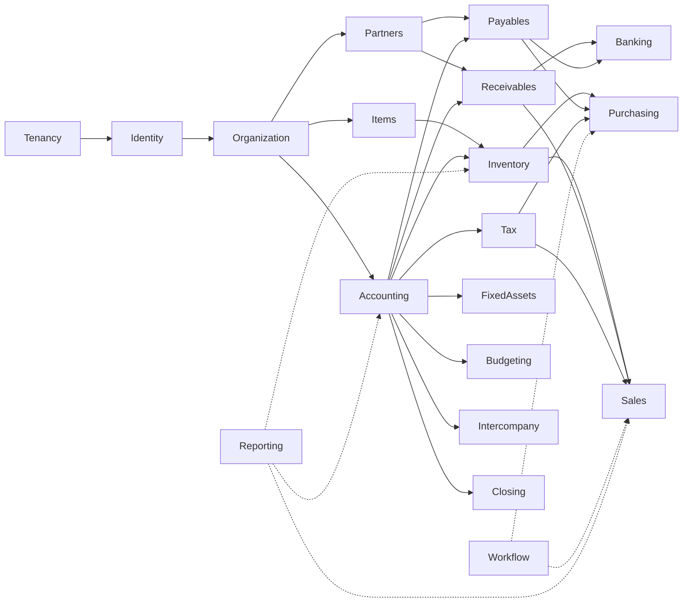
```mermaid
flowchart LR
  Tenancy --> Identity
  Identity --> Organization
  Organization --> Accounting
  Organization --> Partners
  Organization --> Items
  Accounting --> Tax
  Items --> Inventory
  Accounting --> Inventory
  Partners --> Receivables
  Partners --> Payables
  Accounting --> Receivables
  Accounting --> Payables
  Inventory --> Purchasing
  Payables --> Purchasing
  Tax --> Purchasing
  Inventory --> Sales
  Receivables --> Sales
  Tax --> Sales
  Receivables --> Banking
  Payables --> Banking
  Accounting --> FixedAssets
  Accounting --> Budgeting
  Accounting --> Intercompany
  Accounting --> Closing
  Workflow -.-> Sales
  Workflow -.-> Purchasing
  Reporting -.-> Accounting
  Reporting -.-> Sales
  Reporting -.-> Inventory
```

## 2. Control plane: tenants, plans, global identities

Schema `control`. Not under tenant row-level security; the only place that knows about more than one tenant.

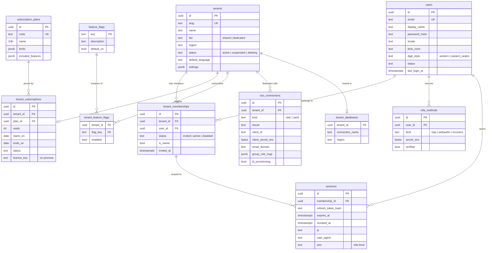
```mermaid
erDiagram
  tenants ||--o{ tenant_memberships : "has members"
  users ||--o{ tenant_memberships : "belongs to"
  tenants ||--o| tenant_subscriptions : "subscribes"
  subscription_plans ||--o{ tenant_subscriptions : "priced by"
  tenants ||--o{ tenant_feature_flags : "toggles"
  feature_flags ||--o{ tenant_feature_flags : "instance of"
  tenants ||--o{ sso_connections : "federates with"
  tenants ||--o| tenant_databases : "routed to"
  users ||--o{ mfa_methods : "secures"
  users ||--o{ sessions : "opens"
  tenant_memberships ||--o{ sessions : "scoped to"

  tenants {
    uuid id PK
    text slug UK
    text name
    text tier "shared | dedicated"
    text region
    text status "active | suspended | deleting"
    text default_language
    jsonb settings
  }
  users {
    uuid id PK
    text email UK
    text display_name
    text password_hash
    text locale
    text time_zone
    text digit_style "western | eastern_arabic"
    text status
    timestamptz last_login_at
  }
  tenant_memberships {
    uuid id PK
    uuid tenant_id FK
    uuid user_id FK
    text status "invited | active | disabled"
    bool is_owner
    timestamptz invited_at
  }
  sessions {
    uuid id PK
    uuid membership_id FK
    text refresh_token_hash
    timestamptz expires_at
    timestamptz revoked_at
    text ip
    text user_agent
    text amr "mfa level"
  }
  mfa_methods {
    uuid id PK
    uuid user_id FK
    text kind "totp | webauthn | recovery"
    bytea secret_enc
    bool verified
  }
  sso_connections {
    uuid id PK
    uuid tenant_id FK
    text kind "oidc | saml"
    text issuer
    text client_id
    bytea client_secret_enc
    text email_domain
    jsonb group_role_map
    bool jit_provisioning
  }
  subscription_plans {
    uuid id PK
    text code UK
    i18n name
    jsonb limits
    jsonb included_features
  }
  tenant_subscriptions {
    uuid id PK
    uuid tenant_id FK
    uuid plan_id FK
    int seats
    date starts_on
    date ends_on
    text status
    text licence_key "on-premise"
  }
  feature_flags {
    text key PK
    text description
    bool default_on
  }
  tenant_feature_flags {
    uuid tenant_id FK
    text flag_key FK
    bool enabled
  }
  tenant_databases {
    uuid tenant_id FK
    text connection_name
    text region
  }
```

## 3. Identity and access (per tenant)

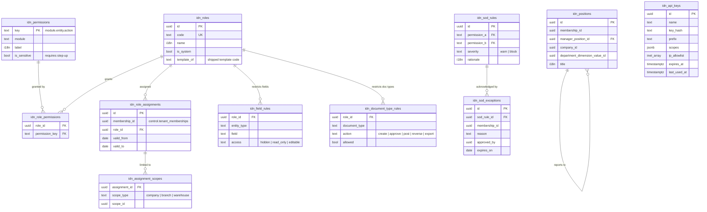
```mermaid
erDiagram
  idn_roles ||--o{ idn_role_permissions : "grants"
  idn_permissions ||--o{ idn_role_permissions : "granted by"
  idn_roles ||--o{ idn_role_assignments : "assigned"
  idn_role_assignments ||--o{ idn_assignment_scopes : "limited to"
  idn_roles ||--o{ idn_field_rules : "restricts fields"
  idn_roles ||--o{ idn_document_type_rules : "restricts doc types"
  idn_sod_rules ||--o{ idn_sod_exceptions : "acknowledged by"
  idn_positions ||--o{ idn_positions : "reports to"

  idn_permissions {
    text key PK "module.entity.action"
    text module
    i18n label
    bool is_sensitive "requires step-up"
  }
  idn_roles {
    uuid id PK
    text code UK
    i18n name
    bool is_system
    text template_of "shipped template code"
  }
  idn_role_permissions {
    uuid role_id FK
    text permission_key FK
  }
  idn_role_assignments {
    uuid id PK
    uuid membership_id "control.tenant_memberships"
    uuid role_id FK
    date valid_from
    date valid_to
  }
  idn_assignment_scopes {
    uuid assignment_id FK
    text scope_type "company | branch | warehouse"
    uuid scope_id
  }
  idn_field_rules {
    uuid role_id FK
    text entity_type
    text field
    text access "hidden | read_only | editable"
  }
  idn_document_type_rules {
    uuid role_id FK
    text document_type
    text action "create | approve | post | reverse | export"
    bool allowed
  }
  idn_sod_rules {
    uuid id PK
    text permission_a FK
    text permission_b FK
    text severity "warn | block"
    i18n rationale
  }
  idn_sod_exceptions {
    uuid id PK
    uuid sod_rule_id FK
    uuid membership_id
    text reason
    uuid approved_by
    date expires_on
  }
  idn_api_keys {
    uuid id PK
    text name
    text key_hash
    text prefix
    jsonb scopes
    inet_array ip_allowlist
    timestamptz expires_at
    timestamptz last_used_at
  }
  idn_positions {
    uuid id PK
    uuid membership_id
    uuid manager_position_id FK
    uuid company_id
    uuid department_dimension_value_id
    i18n title
  }
```

## 4. Audit, numbering, custom fields, collaboration, saved views

```mermaid
erDiagram
  aud_chain_heads ||--o{ aud_events : "chains"
  aud_chain_heads ||--o{ aud_anchors : "anchored by"
  aud_chain_heads ||--o{ aud_verifications : "verified by"
  cf_definitions ||--o{ cf_options : "offers"
  col_comments ||--o{ col_comments : "replies to"
  col_attachments ||--o{ col_attachments : "replaced by"
  col_notifications }o--|| col_notification_preferences : "filtered by"

  aud_events {
    uuid id PK
    bigint seq "1..n per tenant, assigned by the chaining trigger"
    timestamptz occurred_at "partition key, monthly"
    text actor_type "user | api_key | system | anonymous"
    uuid actor_id
    text actor_display
    inet actor_ip
    text user_agent
    text request_id
    text correlation_id
    uuid company_id
    text entity_type
    uuid entity_id
    text entity_display
    text action
    jsonb before
    jsonb after
    jsonb diff "field: old, new"
    jsonb details
    text reason
    bytea prev_hash
    bytea hash "sha256(prev_hash || canonical)"
  }
  aud_chain_heads {
    uuid tenant_id PK
    bigint seq
    bytea head_hash
    timestamptz updated_at
  }
  aud_anchors {
    uuid id PK
    text chain "tenant | platform (control schema)"
    uuid tenant_id
    bigint seq
    bytea head_hash
    timestamptz anchored_at
    text store "file | object-lock (M1.8)"
    text reference
    text receipt
  }
  aud_verifications {
    uuid id PK
    text chain "tenant | platform (control schema)"
    uuid tenant_id
    timestamptz verified_at
    bigint from_seq
    bigint to_seq
    text status "ok | empty | broken | truncated | anchor_mismatch"
    bigint first_broken_seq
    text message
    bigint anchor_seq
    bool anchor_matched
    int duration_ms
  }
  num_series {
    uuid id PK
    text code
    text document_type
    uuid company_id
    uuid branch_id
    uuid fiscal_year_id
    text template "INV-{branch}-{yy}-{seq:6}"
    bigint next_number
    bool gapless
    text reset_policy "never | yearly | monthly"
    date valid_from
    date valid_to
    bool is_default
  }
  cf_definitions {
    uuid id PK
    text entity_type
    text key
    i18n label
    text data_type
    jsonb validation
    jsonb default_value
    bool is_required
    bool is_indexed
    bool is_reportable
    bool show_on_list
    bool show_on_print
    text applies_when "safe expression"
    text section
    int sort_order
    timestamptz archived_at
  }
  cf_options {
    uuid definition_id FK
    text value
    i18n label
    int sort_order
    bool is_active
  }
  col_attachments {
    uuid id PK
    text entity_type
    uuid entity_id
    text file_name
    text content_type
    bigint size_bytes
    text storage_key
    bytea sha256
    text scan_status
    text visibility "internal | partner"
    uuid replaces_id FK
  }
  col_comments {
    uuid id PK
    text entity_type
    uuid entity_id
    uuid parent_id FK
    text body
    jsonb mentions
    bool is_internal
    timestamptz edited_at
  }
  col_activities {
    uuid id PK
    text entity_type
    uuid entity_id
    text kind "note | call | meeting | task | email | system"
    i18n subject
    text body
    uuid assigned_to
    timestamptz due_at
    text status
    uuid audit_event_id
  }
  col_document_links {
    uuid id PK
    text from_type
    uuid from_id
    text to_type
    uuid to_id
    text relation "created_from | fulfils | invoices | returns | corrects | reverses | mirrors"
    uuid from_line_id
    uuid to_line_id
    numeric quantity
    numeric amount
  }
  col_notifications {
    uuid id PK
    uuid membership_id
    text kind
    i18n title
    text body
    text entity_type
    uuid entity_id
    text channel "in_app | email | push"
    timestamptz read_at
    timestamptz sent_at
  }
  col_notification_preferences {
    uuid membership_id PK
    text kind PK
    bool in_app
    bool email
    text digest "none | daily"
  }
  col_email_log {
    uuid id PK
    text entity_type
    uuid entity_id
    text to_addresses
    text subject
    text provider_message_id
    text status
    timestamptz sent_at
  }
  ux_saved_views {
    uuid id PK
    text entity_type
    i18n name
    uuid owner_membership_id
    text sharing "private | role | tenant"
    jsonb definition "filters, columns, sort, group, pivot"
    bool is_default
  }
```

`col_document_links` is the two-way document chain: every line of a downstream document links to its source line with the quantity or amount it consumed, so "remaining to ship/invoice/receive" is always a sum over links, and the chain is navigable in both directions from any document.

## 5. Organization: companies, branches, calendars, currencies, dimensions, UoM

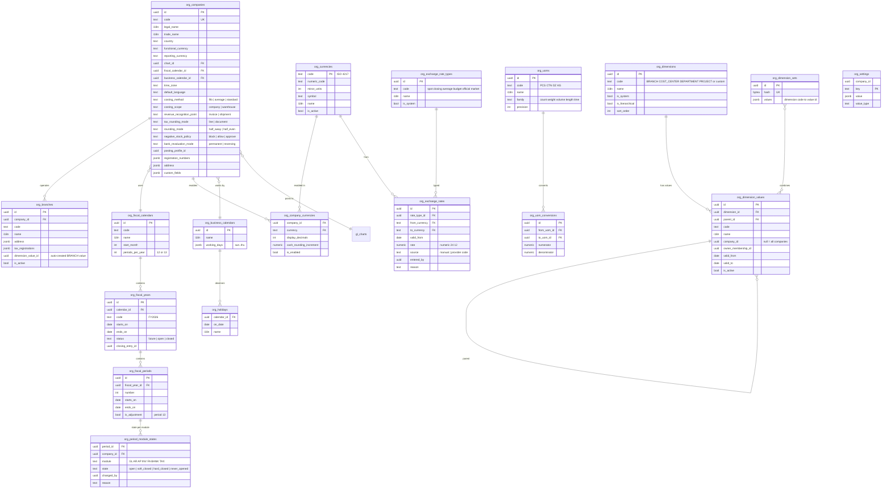
```mermaid
erDiagram
  org_companies ||--o{ org_branches : "operates"
  org_companies }o--|| org_fiscal_calendars : "uses"
  org_fiscal_calendars ||--o{ org_fiscal_years : "contains"
  org_fiscal_years ||--o{ org_fiscal_periods : "contains"
  org_fiscal_periods ||--o{ org_period_module_states : "state per module"
  org_companies ||--o{ org_company_currencies : "enables"
  org_currencies ||--o{ org_company_currencies : "enabled in"
  org_exchange_rate_types ||--o{ org_exchange_rates : "typed"
  org_currencies ||--o{ org_exchange_rates : "from"
  org_dimensions ||--o{ org_dimension_values : "has values"
  org_dimension_values ||--o{ org_dimension_values : "parent"
  org_dimension_sets }o--o{ org_dimension_values : "combines"
  org_uoms ||--o{ org_uom_conversions : "converts"
  org_companies }o--|| org_business_calendars : "works by"
  org_business_calendars ||--o{ org_holidays : "observes"
  org_companies }o--|| gl_charts : "posts to"

  org_companies {
    uuid id PK
    text code UK
    i18n legal_name
    i18n trade_name
    text country
    text functional_currency
    text reporting_currency
    uuid chart_id FK
    uuid fiscal_calendar_id FK
    uuid business_calendar_id FK
    text time_zone
    text default_language
    text costing_method "fifo | average | standard"
    text costing_scope "company | warehouse"
    text revenue_recognition_point "invoice | shipment"
    text tax_rounding_mode "line | document"
    text rounding_mode "half_away | half_even"
    text negative_stock_policy "block | allow | approve"
    text bank_revaluation_mode "permanent | reversing"
    uuid posting_profile_id
    jsonb registration_numbers
    jsonb address
    jsonb custom_fields
  }
  org_branches {
    uuid id PK
    uuid company_id FK
    text code
    i18n name
    jsonb address
    jsonb tax_registrations
    uuid dimension_value_id "auto-created BRANCH value"
    bool is_active
  }
  org_fiscal_calendars {
    uuid id PK
    text code
    i18n name
    int start_month
    int periods_per_year "12 or 13"
  }
  org_fiscal_years {
    uuid id PK
    uuid calendar_id FK
    text code "FY2026"
    date starts_on
    date ends_on
    text status "future | open | closed"
    uuid closing_entry_id
  }
  org_fiscal_periods {
    uuid id PK
    uuid fiscal_year_id FK
    int number
    date starts_on
    date ends_on
    bool is_adjustment "period 13"
  }
  org_period_module_states {
    uuid period_id FK
    uuid company_id FK
    text module "GL AR AP INV FA BANK TAX"
    text state "open | soft_closed | hard_closed | never_opened"
    uuid changed_by
    text reason
  }
  org_currencies {
    text code PK "ISO 4217"
    text numeric_code
    int minor_units
    text symbol
    i18n name
    bool is_active
  }
  org_company_currencies {
    uuid company_id FK
    text currency FK
    int display_decimals
    numeric cash_rounding_increment
    bool is_enabled
  }
  org_exchange_rate_types {
    uuid id PK
    text code "spot closing average budget official market"
    i18n name
    bool is_system
  }
  org_exchange_rates {
    uuid id PK
    uuid rate_type_id FK
    text from_currency FK
    text to_currency FK
    date valid_from
    numeric rate "numeric 24 12"
    text source "manual | provider code"
    uuid entered_by
    text reason
  }
  org_dimensions {
    uuid id PK
    text code "BRANCH COST_CENTER DEPARTMENT PROJECT or custom"
    i18n name
    bool is_system
    bool is_hierarchical
    int sort_order
  }
  org_dimension_values {
    uuid id PK
    uuid dimension_id FK
    uuid parent_id FK
    text code
    i18n name
    uuid company_id "null = all companies"
    uuid owner_membership_id
    date valid_from
    date valid_to
    bool is_active
  }
  org_dimension_sets {
    uuid id PK
    bytea hash UK
    jsonb values "dimension code to value id"
  }
  org_uoms {
    uuid id PK
    text code "PCS CTN DZ KG"
    i18n name
    text family "count weight volume length time"
    int precision
  }
  org_uom_conversions {
    uuid id PK
    uuid from_uom_id FK
    uuid to_uom_id FK
    numeric numerator
    numeric denominator
  }
  org_business_calendars {
    uuid id PK
    i18n name
    jsonb working_days "sun..thu"
  }
  org_holidays {
    uuid calendar_id FK
    date on_date
    i18n name
  }
  org_settings {
    uuid company_id
    text key PK
    jsonb value
    text value_type
  }
```

Notes:

* A tenant has one or more companies; companies may share a chart of accounts (`gl_charts`) and a fiscal calendar or have their own.
* Branch is both an organizational unit and a system dimension: creating a branch creates its `BRANCH` dimension value, so branch reporting works through the same dimension machinery as cost centres.
* `org_dimension_sets` deduplicates dimension combinations by hash so journal lines, balances and budgets reference one id per combination.

## 6. Accounting: chart, ledger, posting profiles, journals, periods

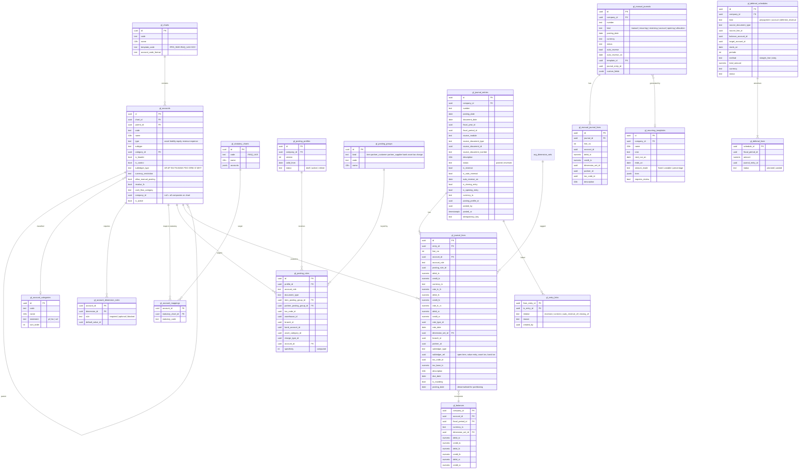
```mermaid
erDiagram
  gl_charts ||--o{ gl_accounts : "contains"
  gl_accounts ||--o{ gl_accounts : "parent"
  gl_accounts }o--o| gl_account_categories : "classified"
  gl_accounts ||--o{ gl_account_dimension_rules : "requires"
  gl_accounts ||--o{ gl_account_mappings : "maps to statutory"
  gl_statutory_charts ||--o{ gl_account_mappings : "target"
  gl_posting_profiles ||--o{ gl_posting_rules : "resolves"
  gl_posting_groups ||--o{ gl_posting_rules : "keyed by"
  gl_accounts ||--o{ gl_posting_rules : "targets"
  gl_journal_entries ||--|{ gl_journal_lines : "has"
  gl_accounts ||--o{ gl_journal_lines : "posted to"
  org_dimension_sets ||--o{ gl_journal_lines : "tagged"
  gl_journal_entries ||--o{ gl_entry_links : "linked"
  gl_journal_lines }o--|| gl_balances : "increments"
  gl_manual_journals ||--|{ gl_manual_journal_lines : "has"
  gl_manual_journals }o--o| gl_recurring_templates : "generated by"
  gl_deferral_schedules ||--|{ gl_deferral_lines : "amortises"

  gl_charts {
    uuid id PK
    text code
    i18n name
    text template_code "IFRS_SME IRAQ_UAS GCC"
    text account_code_format
  }
  gl_accounts {
    uuid id PK
    uuid chart_id FK
    uuid parent_id FK
    text code
    i18n name
    text type "asset liability equity revenue expense"
    text subtype
    uuid category_id FK
    bool is_header
    bool is_control
    text subledger_type "AR AP INV FA BANK PDC GRNI IC WHT"
    text currency_restriction
    bool allow_manual_posting
    bool revalue_fx
    text cash_flow_category
    uuid company_id "null = all companies on chart"
    bool is_active
  }
  gl_account_categories {
    uuid id PK
    text code
    i18n name
    text statement "pl | bs | ocf"
    int sort_order
  }
  gl_account_dimension_rules {
    uuid account_id FK
    uuid dimension_id FK
    text rule "required | optional | blocked"
    uuid default_value_id
  }
  gl_statutory_charts {
    uuid id PK
    text code "IRAQ_UAS"
    i18n name
    jsonb accounts
  }
  gl_account_mappings {
    uuid account_id FK
    uuid statutory_chart_id FK
    text statutory_code
  }
  gl_posting_groups {
    uuid id PK
    text kind "item partner_customer partner_supplier bank asset tax charge"
    text code
    i18n name
  }
  gl_posting_profiles {
    uuid id PK
    uuid company_id FK
    int version
    date valid_from
    text status "draft | active | retired"
  }
  gl_posting_rules {
    uuid id PK
    uuid profile_id FK
    text account_role
    text document_type
    uuid item_posting_group_id FK
    uuid partner_posting_group_id FK
    uuid tax_code_id
    uuid warehouse_id
    uuid branch_id
    uuid bank_account_id
    uuid asset_category_id
    uuid charge_type_id
    uuid account_id FK
    int specificity "computed"
  }
  gl_journal_entries {
    uuid id PK
    uuid company_id FK
    text number
    date posting_date
    date document_date
    uuid fiscal_year_id
    uuid fiscal_period_id
    text source_module
    text source_document_type
    uuid source_document_id
    text source_document_number
    i18n description
    text status "posted | reversed"
    bool is_reversal
    bool is_auto_reversal
    date auto_reverse_on
    bool is_closing_entry
    bool is_opening_entry
    text currency_tc
    uuid posting_profile_id
    uuid posted_by
    timestamptz posted_at
    text idempotency_key
  }
  gl_journal_lines {
    uuid id PK
    uuid entry_id FK
    int line_no
    uuid account_id FK
    text account_role
    uuid posting_rule_id
    numeric debit_tc
    numeric credit_tc
    text currency_tc
    numeric rate_tc_fc
    numeric debit_fc
    numeric credit_fc
    numeric rate_fc_rc
    numeric debit_rc
    numeric credit_rc
    uuid rate_type_id
    date rate_date
    uuid dimension_set_id FK
    uuid branch_id
    uuid partner_id
    text subledger_type
    uuid subledger_ref "open item, value entry, asset txn, bank txn"
    uuid tax_code_id
    numeric tax_base_tc
    i18n description
    date due_date
    bool is_rounding
    date posting_date "denormalised for partitioning"
  }
  gl_entry_links {
    uuid from_entry_id FK
    uuid to_entry_id FK
    text relation "reverses | corrects | auto_reversal_of | closing_of"
    text reason
    uuid created_by
  }
  gl_balances {
    uuid company_id FK
    uuid account_id FK
    uuid fiscal_period_id FK
    text currency_tc
    uuid dimension_set_id FK
    numeric debit_tc
    numeric credit_tc
    numeric debit_fc
    numeric credit_fc
    numeric debit_rc
    numeric credit_rc
  }
  gl_manual_journals {
    uuid id PK
    uuid company_id FK
    text number
    text kind "manual | recurring | reversing | accrual | opening | allocation"
    date posting_date
    text currency
    text status
    bool auto_reverse
    date auto_reverse_on
    uuid template_id FK
    uuid journal_entry_id
    jsonb custom_fields
  }
  gl_manual_journal_lines {
    uuid id PK
    uuid journal_id FK
    int line_no
    uuid account_id
    numeric debit_tc
    numeric credit_tc
    uuid dimension_set_id
    uuid partner_id
    uuid tax_code_id
    i18n description
  }
  gl_recurring_templates {
    uuid id PK
    uuid company_id FK
    i18n name
    text cron
    date next_run_on
    date ends_on
    text amount_mode "fixed | variable | percentage"
    jsonb lines
    bool requires_review
  }
  gl_deferral_schedules {
    uuid id PK
    uuid company_id FK
    text kind "prepayment | accrual | deferred_revenue"
    text source_document_type
    uuid source_line_id
    uuid balance_account_id
    uuid target_account_id
    date starts_on
    int periods
    text method "straight_line | daily"
    numeric total_amount
    text currency
    text status
  }
  gl_deferral_lines {
    uuid schedule_id FK
    uuid fiscal_period_id
    numeric amount
    uuid journal_entry_id
    text status "planned | posted"
  }
```

### 6.1 `gl_journal_lines` rules (database-enforced)

1. Exactly one of `debit_tc`/`credit_tc` is non-zero, both ≥ 0; the same for fc and rc columns. Scale never exceeds the currency's minor units.
2. A constraint trigger at commit asserts per entry: Σdebit = Σcredit for tc, fc and rc.
3. If the account `is_control`, `subledger_type` and `subledger_ref` are required and `subledger_type` must equal the account's; otherwise they must be null.
4. `dimension_set_id` must satisfy the account's dimension rules (validated in the engine; a periodic checker re-validates).
5. The (company, posting_date) → fiscal period resolution is stored on the entry, never recomputed.
6. Partitioned by `posting_date` (yearly); `(tenant_id, company_id, account_id, posting_date)` and `(tenant_id, entry_id)` indexes; `(tenant_id, subledger_type, subledger_ref)` for reconciliation.

### 6.2 `gl_balances`

Grain: company × account × fiscal period × transaction currency × dimension set. Maintained with `INSERT ... ON CONFLICT DO UPDATE` in the posting transaction; opening balances per year are computed from the prior year's closing rows plus the closing entry. Rebuildable (ADR-0007).

## 7. Partners: customers, suppliers, contacts, CRM

```mermaid
erDiagram
  ptr_partners ||--o{ ptr_contacts : "has"
  ptr_partners ||--o{ ptr_partner_addresses : "located at"
  ptr_partners ||--o{ ptr_partner_bank_accounts : "pays via"
  ptr_partners ||--o{ ptr_partner_tax_registrations : "registered"
  ptr_partners ||--o{ ptr_customer_accounts : "as customer in company"
  ptr_partners ||--o{ ptr_supplier_accounts : "as supplier in company"
  ptr_customer_groups ||--o{ ptr_customer_accounts : "groups"
  ptr_supplier_groups ||--o{ ptr_supplier_accounts : "groups"
  ptr_payment_terms ||--o{ ptr_payment_term_lines : "instalments"
  ptr_payment_terms ||--o{ ptr_customer_accounts : "default terms"
  ptr_payment_terms ||--o{ ptr_supplier_accounts : "default terms"
  ptr_sales_reps ||--o{ ptr_customer_accounts : "owns"
  ptr_partners ||--o{ ptr_partner_relationships : "related"
  ptr_partners ||--o{ ptr_opportunities : "pursued with"
  ptr_pipeline_stages ||--o{ ptr_opportunities : "at stage"
  ptr_opportunities ||--o{ ptr_opportunity_stage_changes : "moved"
  ptr_commission_plans ||--|{ ptr_commission_rules : "bands"
  ptr_commission_plans ||--o{ ptr_sales_reps : "pays"
  ptr_partners ||--o{ ptr_crm_activities : "with"
  ptr_opportunities ||--o{ ptr_crm_activities : "about"

  ptr_partners {
    uuid id PK
    text code UK
    i18n legal_name
    i18n trade_name
    text kind "organization | person"
    bool is_customer
    bool is_supplier
    bool is_employee
    uuid intercompany_company_id "if this partner is a group company"
    text default_language
    text website
    text email
    text phone
    uuid parent_partner_id
    jsonb custom_fields
    bool is_active
  }
  ptr_contacts {
    uuid id PK
    uuid partner_id FK
    i18n name
    text role
    text email
    text phone
    bool is_primary
    bool receives_statements
  }
  ptr_partner_addresses {
    uuid id PK
    uuid partner_id FK
    text role "billing | shipping | legal | other"
    jsonb address "structured bilingual"
    text country
    text region
    bool is_default
  }
  ptr_partner_bank_accounts {
    uuid id PK
    uuid partner_id FK
    text bank_name
    bytea account_number_enc
    text iban_masked
    text currency
    bool is_default
  }
  ptr_partner_tax_registrations {
    uuid partner_id FK
    text country
    text registration_type "vat | tin | crn"
    text number
    date valid_from
  }
  ptr_customer_accounts {
    uuid id PK
    uuid partner_id FK
    uuid company_id FK
    uuid customer_group_id FK
    uuid payment_terms_id FK
    uuid price_list_id "5.2"
    uuid posting_group_id
    uuid tax_group_id
    text currency
    numeric credit_limit "functional currency; empty = none"
    text credit_status "ok | on_hold | blocked"
    text credit_status_reason
    text credit_exposure_basis "open_ar | open_ar_plus_orders"
    int overdue_block_days
    uuid sales_rep_id FK
    uuid default_warehouse_id
    uuid delivery_terms_id
    int dunning_level
    text statement_frequency "none | weekly | monthly"
    bool is_active
  }
  ptr_supplier_accounts {
    uuid id PK
    uuid partner_id FK
    uuid company_id FK
    uuid supplier_group_id FK
    uuid payment_terms_id FK
    uuid posting_group_id
    uuid tax_group_id
    uuid wht_code_id
    text currency
    int lead_time_days
    numeric price_tolerance_pct
    numeric qty_tolerance_pct
    bool requires_po
    bool on_hold
    numeric performance_score
    bool is_active
  }
  ptr_customer_groups {
    uuid id PK
    text code
    i18n name
    uuid price_list_id "5.2"
    uuid posting_group_id
    uuid payment_terms_id
    uuid delivery_terms_id
  }
  ptr_supplier_groups {
    uuid id PK
    text code
    i18n name
    uuid posting_group_id
  }
  ptr_payment_terms {
    uuid id PK
    text code
    i18n name
    int due_days
    text due_basis "invoice_date | end_of_month | delivery"
    numeric early_discount_pct
    int early_discount_days
    bool business_days_only
  }
  ptr_payment_term_lines {
    uuid terms_id FK
    int sequence
    numeric percentage
    int days
  }
  ptr_delivery_terms {
    uuid id PK
    text code "EXW FOB CIF DAP"
    i18n name
  }
  ptr_sales_reps {
    uuid id PK
    uuid membership_id "unique"
    uuid partner_id "employee partner"
    text code
    i18n name
    uuid company_id "empty = every company"
    uuid commission_plan_id FK
    bool is_active
  }
  ptr_commission_plans {
    uuid id PK
    text code
    i18n name
    text basis "revenue | margin | collected"
    text accrual_point "invoice | payment"
    text tier_period "month | quarter | year"
    text currency
  }
  ptr_commission_rules {
    uuid plan_id FK
    int sequence
    uuid item_category_id "and descendants"
    uuid customer_group_id
    numeric from_amount "marginal band start"
    numeric rate_pct
  }
  ptr_partner_relationships {
    uuid partner_id FK
    uuid related_partner_id FK
    text relation "affiliate | parent | contact_of"
  }
  ptr_opportunities {
    uuid id PK
    uuid company_id
    text number "OPP-yyyy-nnnnn per company"
    uuid partner_id FK
    uuid contact_id
    text title
    uuid stage_id FK
    uuid sales_rep_id
    numeric expected_amount
    text currency
    int probability_pct
    date expected_close
    text source
    text status "open | won | lost"
    text lost_reason
    date closed_on
    jsonb custom_fields
  }
  ptr_opportunity_stage_changes {
    uuid id PK
    uuid opportunity_id FK
    uuid from_stage_id
    uuid to_stage_id
    int probability_pct
    numeric expected_amount
    timestamptz changed_at
  }
  ptr_pipeline_stages {
    uuid id PK
    text code
    i18n name
    int sort_order
    int default_probability
    text outcome "open | won 100 | lost 0"
    bool is_system
  }
  ptr_crm_activities {
    uuid id PK
    uuid partner_id FK
    uuid company_id
    uuid opportunity_id FK
    uuid contact_id
    text kind "call | meeting | email | task | note"
    text subject
    timestamptz due_at
    uuid assigned_membership_id
    text status "open | done | cancelled"
    text outcome
  }
```

The **Customer 360** screen composes `ptr_partners` + `ptr_customer_accounts` (per company) + `ptr_contacts` + addresses + `ptr_opportunities` + `ptr_crm_activities` + AR open items + sales documents via read contracts.

Commission plans are master data about the sales team and live here (A-142); the accruals they drive, `sls_commission_entries`, stay with invoicing. CRM activities are planned work with a partner (assigned, due, done or cancelled) and are kept apart from `col_activities`, the system's append-only account of what happened to a record.

## 8. Items and units of measure

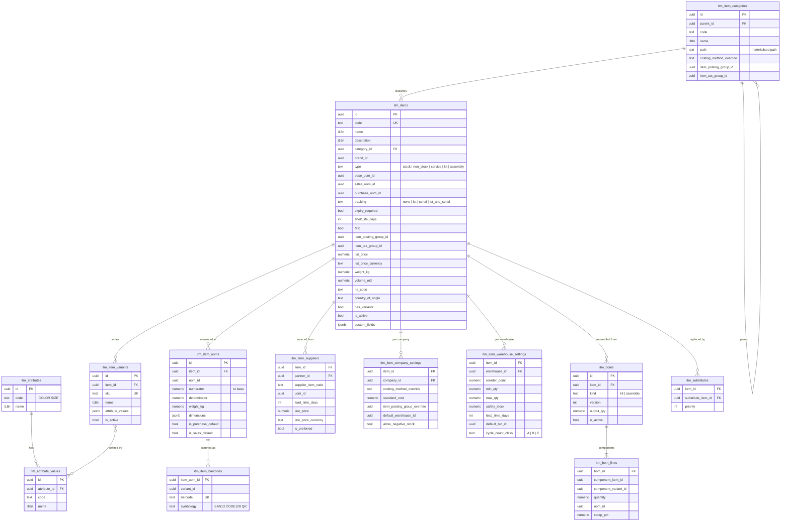
```mermaid
erDiagram
  itm_item_categories ||--o{ itm_item_categories : "parent"
  itm_item_categories ||--o{ itm_items : "classifies"
  itm_items ||--o{ itm_item_variants : "varies"
  itm_attributes ||--o{ itm_attribute_values : "has"
  itm_item_variants }o--o{ itm_attribute_values : "defined by"
  itm_items ||--o{ itm_item_uoms : "measured in"
  itm_item_uoms ||--o{ itm_item_barcodes : "scanned as"
  itm_items ||--o{ itm_item_suppliers : "sourced from"
  itm_items ||--o{ itm_item_company_settings : "per company"
  itm_items ||--o{ itm_item_warehouse_settings : "per warehouse"
  itm_items ||--o{ itm_boms : "assembled from"
  itm_boms ||--|{ itm_bom_lines : "components"
  itm_items ||--o{ itm_substitutes : "replaced by"

  itm_items {
    uuid id PK
    text code UK
    i18n name
    i18n description
    uuid category_id FK
    uuid brand_id
    text type "stock | non_stock | service | kit | assembly"
    uuid base_uom_id
    uuid sales_uom_id
    uuid purchase_uom_id
    text tracking "none | lot | serial | lot_and_serial"
    bool expiry_required
    int shelf_life_days
    bool fefo
    uuid item_posting_group_id
    uuid item_tax_group_id
    numeric list_price
    text list_price_currency
    numeric weight_kg
    numeric volume_m3
    text hs_code
    text country_of_origin
    bool has_variants
    bool is_active
    jsonb custom_fields
  }
  itm_item_categories {
    uuid id PK
    uuid parent_id FK
    text code
    i18n name
    text path "materialised path"
    text costing_method_override
    uuid item_posting_group_id
    uuid item_tax_group_id
  }
  itm_item_variants {
    uuid id PK
    uuid item_id FK
    text sku UK
    i18n name
    jsonb attribute_values
    bool is_active
  }
  itm_attributes {
    uuid id PK
    text code "COLOR SIZE"
    i18n name
  }
  itm_attribute_values {
    uuid id PK
    uuid attribute_id FK
    text code
    i18n name
  }
  itm_item_uoms {
    uuid id PK
    uuid item_id FK
    uuid uom_id
    numeric numerator "to base"
    numeric denominator
    numeric weight_kg
    jsonb dimensions
    bool is_purchase_default
    bool is_sales_default
  }
  itm_item_barcodes {
    uuid item_uom_id FK
    uuid variant_id
    text barcode UK
    text symbology "EAN13 CODE128 QR"
  }
  itm_item_suppliers {
    uuid item_id FK
    uuid partner_id FK
    text supplier_item_code
    uuid uom_id
    int lead_time_days
    numeric last_price
    text last_price_currency
    bool is_preferred
  }
  itm_item_company_settings {
    uuid item_id FK
    uuid company_id FK
    text costing_method_override
    numeric standard_cost
    uuid item_posting_group_override
    uuid default_warehouse_id
    bool allow_negative_stock
  }
  itm_item_warehouse_settings {
    uuid item_id FK
    uuid warehouse_id FK
    numeric reorder_point
    numeric min_qty
    numeric max_qty
    numeric safety_stock
    int lead_time_days
    uuid default_bin_id
    text cycle_count_class "A | B | C"
  }
  itm_boms {
    uuid id PK
    uuid item_id FK
    text kind "kit | assembly"
    int version
    numeric output_qty
    bool is_active
  }
  itm_bom_lines {
    uuid bom_id FK
    uuid component_item_id
    uuid component_variant_id
    numeric quantity
    uuid uom_id
    numeric scrap_pct
  }
  itm_substitutes {
    uuid item_id FK
    uuid substitute_item_id FK
    int priority
  }
```

Quantities on every stock document are converted to the base unit through `itm_item_uoms` (exact rational factors) at entry; the entered UoM and quantity are stored alongside for display and printing. Hard scenario 9 is a property test over these factors.

## 9. Inventory: warehouses, stock ledger, valuation, tracking, counts

```mermaid
erDiagram
  inv_warehouses ||--o{ inv_bins : "contains"
  inv_warehouses ||--o{ inv_stock_ledger_entries : "moves in"
  inv_stock_ledger_entries ||--|{ inv_stock_value_entries : "valued by"
  inv_stock_ledger_entries ||--o{ inv_item_applications : "outbound"
  inv_stock_ledger_entries ||--o{ inv_item_applications : "inbound"
  inv_lots ||--o{ inv_stock_ledger_entries : "of lot"
  inv_serials ||--o{ inv_stock_ledger_entries : "of serial"
  inv_stock_ledger_entries }o--|| inv_stock_balances : "sums to"
  inv_stock_value_entries }o--|| inv_item_costs : "averages to"
  inv_cost_adjustment_runs ||--o{ inv_stock_value_entries : "creates"
  inv_reservations }o--|| inv_stock_balances : "reserves"
  inv_transfers ||--|{ inv_transfer_lines : "has"
  inv_adjustments ||--|{ inv_adjustment_lines : "has"
  inv_reason_codes ||--o{ inv_adjustment_lines : "explains"
  inv_counts ||--|{ inv_count_lines : "has"
  inv_counts ||--|{ inv_count_snapshots : "froze"
  inv_assemblies ||--|{ inv_assembly_lines : "consumes"
  inv_pick_lists ||--|{ inv_pick_lines : "has"
  inv_standard_cost_versions ||--o{ inv_revaluations : "triggers"

  inv_warehouses {
    uuid id PK
    uuid company_id FK
    uuid branch_id
    text code
    i18n name
    text kind "standard | in_transit | consignment | quarantine | virtual"
    bool bins_enabled
    uuid dimension_value_id
    uuid inventory_posting_group_id
    jsonb address
    bool is_active
  }
  inv_bins {
    uuid id PK
    uuid warehouse_id FK
    text code
    text zone
    text kind "storage | receiving | shipping | quarantine | returns"
    int pick_sequence
    bool is_active
  }
  inv_stock_ledger_entries {
    uuid id PK
    bigint sequence "global order"
    uuid company_id
    uuid item_id
    uuid variant_id
    uuid warehouse_id FK
    uuid bin_id
    uuid lot_id FK
    uuid serial_id FK
    text entry_type
    numeric quantity "signed base uom"
    uuid entered_uom_id
    numeric entered_quantity
    date posting_date
    text source_document_type
    uuid source_document_id
    uuid source_line_id
    text ownership "own | consigned_in | consigned_out"
    uuid owner_partner_id
    numeric remaining_quantity "FIFO layers"
    bool cost_is_expected
    bool costed_at_expected "negative stock"
    uuid transfer_pair_id
    uuid posted_by
    timestamptz posted_at
  }
  inv_stock_value_entries {
    uuid id PK
    uuid sle_id FK
    uuid company_id
    uuid item_id
    uuid warehouse_id
    date posting_date
    date valuation_date
    text value_type "direct_cost indirect_cost expected_cost expected_cost_reversal revaluation variance rounding cost_adjustment"
    numeric valued_quantity
    numeric unit_cost "numeric 24 10"
    numeric cost_amount_actual
    numeric cost_amount_expected
    text currency_fc
    uuid gl_journal_entry_id
    uuid adjusts_sve_id
    uuid adjustment_run_id FK
    text source_document_type
    uuid source_document_id
    jsonb reason
    uuid cost_posting_group_id
  }
  inv_item_applications {
    uuid id PK
    uuid outbound_sle_id FK
    uuid inbound_sle_id FK
    numeric quantity
    bool is_reapplication
    uuid superseded_by FK
    timestamptz applied_at
  }
  inv_stock_balances {
    uuid company_id
    uuid item_id
    uuid variant_id
    uuid warehouse_id
    uuid bin_id
    uuid lot_id
    uuid serial_id
    numeric on_hand
    numeric reserved
    numeric quality_hold
    numeric in_transit_out
    timestamptz last_movement_at
  }
  inv_item_costs {
    uuid company_id
    uuid item_id
    uuid warehouse_id "null when scope = company"
    date valuation_date
    numeric quantity
    numeric value
    numeric average_unit_cost
    numeric last_cost
    numeric standard_cost
    bool valuation_pending
  }
  inv_cost_adjustment_runs {
    uuid id PK
    uuid company_id
    uuid item_id
    text trigger_document_type
    uuid trigger_document_id
    date from_date
    int entries_reapplied
    int value_entries_created
    uuid gl_journal_entry_id
    text status "running | completed | failed"
    timestamptz started_at
    timestamptz completed_at
  }
  inv_lots {
    uuid id PK
    uuid item_id
    text lot_number
    date manufactured_on
    date expires_on
    text supplier_lot
    uuid supplier_partner_id
    text status "active | quarantine | recalled | expired | consumed"
    text recall_reference
    jsonb custom_fields
  }
  inv_serials {
    uuid id PK
    uuid item_id
    text serial_number
    uuid lot_id
    text status "in_stock | reserved | sold | returned | in_repair | scrapped | consigned"
    uuid current_warehouse_id
    uuid current_bin_id
    uuid current_partner_id
    date warranty_until
    jsonb custom_fields
  }
  inv_reservations {
    uuid id PK
    uuid company_id
    uuid item_id
    uuid variant_id
    uuid warehouse_id
    uuid bin_id
    uuid lot_id
    uuid serial_id
    numeric quantity
    text source_document_type
    uuid source_line_id
    text status "active | consumed | released"
    date expires_on
  }
  inv_transfers {
    uuid id PK
    uuid company_id
    text number
    uuid from_warehouse_id
    uuid to_warehouse_id
    uuid transit_warehouse_id
    date ship_date
    date receive_date
    text status "draft | shipped | partially_received | received"
    uuid ship_entry_id
    uuid receive_entry_id
    jsonb custom_fields
  }
  inv_transfer_lines {
    uuid id PK
    uuid transfer_id FK
    uuid item_id
    uuid variant_id
    numeric qty_requested
    numeric qty_shipped
    numeric qty_received
    uuid uom_id
    uuid from_bin_id
    uuid to_bin_id
    jsonb tracking "lots and serials"
  }
  inv_adjustments {
    uuid id PK
    uuid company_id
    text number
    uuid warehouse_id
    date posting_date
    text kind "positive | negative | revaluation | scrap | opening"
    text status
    uuid journal_entry_id
    jsonb custom_fields
  }
  inv_adjustment_lines {
    uuid id PK
    uuid adjustment_id FK
    uuid item_id
    uuid variant_id
    uuid bin_id
    uuid lot_id
    uuid serial_id
    numeric quantity
    numeric unit_cost
    uuid reason_code_id FK
    text note
  }
  inv_reason_codes {
    uuid id PK
    text code
    i18n name
    text applies_to "adjustment | count | return | scrap | write_off"
    text account_role_override
    bool requires_note
  }
  inv_counts {
    uuid id PK
    uuid company_id
    text number
    uuid warehouse_id
    text scope "full | cycle | bins | items"
    jsonb scope_filter
    timestamptz frozen_at
    text status "planned | frozen | counting | review | approved | posted | cancelled"
    bool block_movements
    uuid approved_by
    uuid adjustment_id
  }
  inv_count_snapshots {
    uuid count_id FK
    uuid item_id
    uuid variant_id
    uuid bin_id
    uuid lot_id
    uuid serial_id
    numeric expected_qty "at freeze"
    bigint last_sequence "SLE sequence at freeze"
  }
  inv_count_lines {
    uuid id PK
    uuid count_id FK
    uuid item_id
    uuid variant_id
    uuid bin_id
    uuid lot_id
    uuid serial_id
    numeric counted_qty
    numeric movement_since_freeze
    numeric variance_qty
    numeric variance_value
    uuid counted_by
    timestamptz counted_at
    bool recount_requested
    uuid reason_code_id
    text status
  }
  inv_assemblies {
    uuid id PK
    uuid company_id
    text number
    uuid bom_id
    uuid output_item_id
    numeric output_qty
    uuid warehouse_id
    date posting_date
    text status
    uuid journal_entry_id
  }
  inv_assembly_lines {
    uuid assembly_id FK
    uuid component_item_id
    numeric quantity
    uuid bin_id
    jsonb tracking
  }
  inv_pick_lists {
    uuid id PK
    uuid warehouse_id
    text number
    text source_document_type
    uuid source_document_id
    text status
    uuid assigned_to
  }
  inv_pick_lines {
    uuid pick_list_id FK
    uuid source_line_id
    uuid item_id
    uuid bin_id
    numeric qty_to_pick
    numeric qty_picked
    jsonb tracking
  }
  inv_consignment_agreements {
    uuid id PK
    uuid partner_id
    text direction "in | out"
    uuid warehouse_id
    date valid_from
    date valid_to
    text settlement_frequency
  }
  inv_standard_cost_versions {
    uuid id PK
    uuid company_id
    uuid item_id
    numeric standard_cost
    date effective_from
    uuid approved_by
  }
  inv_revaluations {
    uuid id PK
    uuid company_id
    text number
    date posting_date
    text kind "standard_change | nrv_writedown | manual"
    text status
    uuid journal_entry_id
  }
  inv_replenishment_suggestions {
    uuid id PK
    uuid company_id
    uuid item_id
    uuid warehouse_id
    numeric suggested_qty
    uuid suggested_supplier_id
    date needed_by
    jsonb explanation
    text status "open | accepted | dismissed"
    uuid purchase_order_line_id
  }
```

### 9.1 Stock ledger entry types and their value behaviour

| `entry_type` | Sign | Value source | Typical GL (see POSTING_RULES) |
|--------------|------|--------------|-------------------------------|
| purchase_receipt | + | PO price (expected) → invoice price (actual) + landed costs | Inventory / GRNI |
| purchase_return | − | exact cost of the receipt returned | GRNI or AP / Inventory |
| sale_shipment | − | FIFO application or daily average | COGS / Inventory |
| sale_return | + | original shipment cost (or policy) | Inventory / COGS |
| transfer_out, transfer_in | −, + | cost carried across, paired by `transfer_pair_id` | In-transit / Inventory, Inventory / In-transit |
| positive_adjustment | + | entered unit cost (default current cost) | Inventory / Inventory adjustment |
| negative_adjustment, scrap | − | applied cost | Adjustment or scrap expense / Inventory |
| count_variance | ± | as adjustments | Count variance / Inventory |
| assembly_consumption, assembly_output | −, + | components' applied cost → output | Inventory (assembly) / Inventory (components) |
| consignment_in, consignment_out | ± | not valued until ownership transfers | none until consumption |
| drop_ship | +/− pair | pass-through at purchase cost | COGS / GRNI |
| opening | + | entered cost | Inventory / Opening balance equity |

### 9.2 Count freeze logic (hard scenario 11)

At freeze, `inv_count_snapshots` records expected quantities and the global `sequence` of the last stock ledger entry. Movements after the freeze are allowed unless `block_movements` is set. When a count line is posted, `movement_since_freeze` = Σ quantity of entries for that (item, bin, lot, serial) with `sequence` > snapshot sequence and `posting_date` ≤ count posting date; variance = counted − (expected + movement_since_freeze). This keeps the count honest while the warehouse works.

## 10. Purchasing (procure to pay)

```mermaid
erDiagram
  pur_requisitions ||--|{ pur_requisition_lines : "has"
  pur_rfqs ||--|{ pur_rfq_lines : "has"
  pur_rfqs ||--o{ pur_rfq_suppliers : "invites"
  pur_rfq_suppliers ||--o| pur_supplier_quotes : "answers"
  pur_supplier_quotes ||--|{ pur_supplier_quote_lines : "has"
  pur_blanket_agreements ||--|{ pur_blanket_lines : "has"
  pur_orders ||--|{ pur_order_lines : "has"
  pur_blanket_lines ||--o{ pur_order_lines : "releases"
  pur_order_lines ||--o{ pur_receipt_lines : "received by"
  pur_receipts ||--|{ pur_receipt_lines : "has"
  pur_receipt_lines ||--o{ pur_invoice_lines : "invoiced by"
  pur_order_lines ||--o{ pur_invoice_lines : "invoiced by"
  pur_invoices ||--|{ pur_invoice_lines : "has"
  pur_invoices ||--o| pur_match_results : "matched"
  pur_tolerance_rules ||--o{ pur_match_results : "evaluated with"
  pur_landed_cost_docs ||--|{ pur_landed_cost_charges : "charges"
  pur_landed_cost_docs ||--|{ pur_landed_cost_allocations : "allocates to"
  pur_receipt_lines ||--o{ pur_landed_cost_allocations : "receives cost"
  pur_charge_types ||--o{ pur_landed_cost_charges : "typed"
  pur_returns ||--|{ pur_return_lines : "has"
  pur_receipt_lines ||--o{ pur_return_lines : "returned from"

  pur_requisitions {
    uuid id PK
    uuid company_id
    uuid branch_id
    text number
    uuid requester_membership_id
    uuid department_value_id
    date needed_by
    text status "draft | pending_approval | approved | ordered | rejected | cancelled"
    text justification
    jsonb custom_fields
  }
  pur_requisition_lines {
    uuid id PK
    uuid requisition_id FK
    uuid item_id
    text description
    numeric quantity
    uuid uom_id
    numeric estimated_price
    text currency
    uuid warehouse_id
    uuid dimension_set_id
    uuid suggested_supplier_id
  }
  pur_rfqs {
    uuid id PK
    uuid company_id
    text number
    date due_on
    text status "draft | sent | closed | awarded"
    uuid awarded_quote_id
  }
  pur_rfq_lines {
    uuid id PK
    uuid rfq_id FK
    uuid item_id
    numeric quantity
    uuid uom_id
    uuid requisition_line_id
  }
  pur_rfq_suppliers {
    uuid id PK
    uuid rfq_id FK
    uuid partner_id
    timestamptz sent_at
    text status "invited | responded | declined"
  }
  pur_supplier_quotes {
    uuid id PK
    uuid rfq_supplier_id FK
    text supplier_reference
    text currency
    date valid_until
    uuid payment_terms_id
    int lead_time_days
    jsonb comparison_score
  }
  pur_supplier_quote_lines {
    uuid quote_id FK
    uuid rfq_line_id
    numeric unit_price
    numeric quantity
    uuid uom_id
    int lead_time_days
  }
  pur_blanket_agreements {
    uuid id PK
    uuid company_id
    text number
    uuid supplier_account_id
    date valid_from
    date valid_to
    text currency
    numeric committed_amount
    text status
  }
  pur_blanket_lines {
    uuid id PK
    uuid agreement_id FK
    uuid item_id
    numeric agreed_qty
    numeric agreed_price
    numeric released_qty
  }
  pur_orders {
    uuid id PK
    uuid company_id
    uuid branch_id
    text number
    uuid supplier_account_id
    text currency
    numeric exchange_rate
    uuid rate_type_id
    date order_date
    date expected_date
    uuid payment_terms_id
    uuid delivery_terms_id
    uuid warehouse_id
    bool drop_ship
    uuid drop_ship_sales_order_id
    text status "draft | pending_approval | approved | sent | partially_received | received | closed | cancelled"
    numeric total_net
    numeric total_tax
    numeric total_gross
    jsonb supplier_snapshot
    uuid approval_request_id
    jsonb custom_fields
  }
  pur_order_lines {
    uuid id PK
    uuid order_id FK
    int line_no
    uuid item_id
    uuid variant_id
    text description
    numeric quantity
    uuid uom_id
    numeric quantity_base
    numeric unit_price
    numeric discount_pct
    uuid tax_code_id
    numeric net_amount
    numeric tax_amount
    date expected_date
    uuid warehouse_id
    uuid dimension_set_id
    numeric qty_received
    numeric qty_invoiced
    numeric qty_cancelled
    uuid requisition_line_id
    uuid blanket_line_id
    jsonb price_breakdown
    text status
  }
  pur_receipts {
    uuid id PK
    uuid company_id
    uuid branch_id
    text number
    uuid supplier_account_id
    uuid warehouse_id
    date posting_date
    text supplier_delivery_note
    text status "draft | posted | reversed"
    uuid journal_entry_id
    jsonb custom_fields
  }
  pur_receipt_lines {
    uuid id PK
    uuid receipt_id FK
    uuid order_line_id FK
    uuid item_id
    uuid variant_id
    numeric quantity
    uuid uom_id
    numeric quantity_base
    uuid bin_id
    jsonb tracking "lots serials expiry"
    numeric expected_unit_cost
    numeric qty_invoiced
    numeric qty_returned
    uuid sle_id
  }
  pur_invoices {
    uuid id PK
    uuid company_id
    uuid branch_id
    text number
    text kind "invoice | debit_note | landed_cost | expense"
    uuid supplier_account_id
    text supplier_invoice_number
    date document_date
    date posting_date
    date due_date
    text currency
    numeric exchange_rate
    uuid payment_terms_id
    numeric total_net
    numeric total_tax
    numeric total_wht
    numeric total_gross
    text status "draft | pending_approval | blocked | approved | posted | reversed"
    text block_reason
    uuid journal_entry_id
    uuid ap_open_item_id
    uuid reverses_id
    jsonb supplier_snapshot
    jsonb custom_fields
  }
  pur_invoice_lines {
    uuid id PK
    uuid invoice_id FK
    int line_no
    uuid receipt_line_id FK
    uuid order_line_id FK
    uuid item_id
    uuid account_id "expense lines"
    text description
    numeric quantity
    uuid uom_id
    numeric unit_price
    numeric discount_pct
    uuid tax_code_id
    numeric net_amount
    numeric tax_amount
    uuid wht_code_id
    numeric wht_amount
    uuid dimension_set_id
    uuid asset_id "capitalise to asset"
    uuid deferral_schedule_id
  }
  pur_match_results {
    uuid id PK
    uuid invoice_id FK
    uuid rule_id FK
    text status "matched | price_variance | qty_variance | no_receipt | duplicate_suspect"
    numeric price_variance_amount
    numeric price_variance_pct
    numeric qty_variance
    jsonb details "per line"
    uuid override_id "wf_overrides"
  }
  pur_tolerance_rules {
    uuid id PK
    uuid company_id
    uuid supplier_account_id
    uuid category_id
    numeric price_tolerance_pct
    numeric price_tolerance_amount
    numeric qty_tolerance_pct
    text on_breach "block | warn"
  }
  pur_charge_types {
    uuid id PK
    text code "FREIGHT CUSTOMS DUTY INSURANCE HANDLING"
    i18n name
    text default_allocation_basis "value | weight | volume | quantity"
    uuid posting_group_id
    bool taxable
  }
  pur_landed_cost_docs {
    uuid id PK
    uuid company_id
    text number
    date posting_date
    text status "draft | posted | reversed"
    text currency
    uuid journal_entry_id
    uuid adjustment_run_id
    jsonb custom_fields
  }
  pur_landed_cost_charges {
    uuid id PK
    uuid landed_cost_id FK
    uuid charge_type_id FK
    uuid supplier_account_id
    uuid supplier_invoice_line_id "when invoiced"
    numeric amount
    text currency
    numeric amount_fc
    text allocation_basis
    bool is_estimate
  }
  pur_landed_cost_allocations {
    uuid id PK
    uuid landed_cost_id FK
    uuid charge_id FK
    uuid receipt_line_id FK
    numeric basis_value
    numeric allocated_amount_fc
    numeric on_hand_portion
    numeric sold_portion
    uuid sve_id
  }
  pur_returns {
    uuid id PK
    uuid company_id
    text number
    uuid supplier_account_id
    uuid warehouse_id
    date posting_date
    text status
    uuid debit_note_id
    uuid journal_entry_id
  }
  pur_return_lines {
    uuid id PK
    uuid return_id FK
    uuid receipt_line_id FK
    uuid item_id
    numeric quantity
    jsonb tracking
    uuid reason_code_id
    uuid sle_id
  }
  pur_supplier_scores {
    uuid supplier_account_id
    date period_start
    numeric on_time_pct
    numeric in_full_pct
    numeric price_variance_pct
    numeric quality_returns_pct
    numeric score
  }
```

Landed costs may be posted **before** the charge invoices exist (`is_estimate` against a landed-cost clearing account) or from the supplier invoice lines directly; when the charge invoice arrives it settles the clearing account. Allocation records the on-hand and sold portions at allocation time, and the cost adjustment run pushes the sold portion to COGS (hard scenario 2).

## 11. Sales (order to cash) and pricing

```mermaid
erDiagram
  sls_quotations ||--|{ sls_quotation_lines : "has"
  sls_quotation_lines ||--o{ sls_order_lines : "converted"
  sls_orders ||--|{ sls_order_lines : "has"
  sls_order_lines ||--o{ sls_shipment_lines : "shipped by"
  sls_shipments ||--|{ sls_shipment_lines : "has"
  sls_shipments ||--o{ sls_packages : "packed in"
  sls_shipment_lines ||--o{ sls_invoice_lines : "invoiced by"
  sls_order_lines ||--o{ sls_invoice_lines : "invoiced by"
  sls_invoices ||--|{ sls_invoice_lines : "has"
  sls_returns ||--|{ sls_return_lines : "has"
  sls_shipment_lines ||--o{ sls_return_lines : "returned from"
  sls_returns ||--o| sls_invoices : "credited by"
  sls_recurring_templates ||--o{ sls_invoices : "generates"
  sls_credit_holds }o--|| ptr_customer_accounts : "on"
  sls_invoice_lines ||--o{ sls_commission_entries : "earns"
  sls_commission_entries }o--|| ptr_commission_plans : "under"
  prc_price_lists ||--|{ prc_price_list_items : "has"
  prc_price_lists ||--o{ prc_price_lists : "derived from"
  prc_price_lists ||--o{ prc_price_list_assignments : "for"
  prc_promotions ||--o{ prc_promotion_components : "bundles"
  prc_promotions ||--o{ prc_promotion_tiers : "tiers"
  prc_discount_rules }o--o{ sls_order_lines : "applied in breakdown"
  prc_promotions ||--o{ prc_promotion_usages : "used"

  sls_quotations {
    uuid id PK
    uuid company_id
    uuid branch_id
    text number
    uuid customer_account_id
    uuid opportunity_id
    text currency
    date quote_date
    date valid_until
    date pricing_date
    uuid price_list_id
    text status "draft | sent | accepted | rejected | expired | converted"
    numeric total_gross
    jsonb customer_snapshot
    jsonb custom_fields
  }
  sls_quotation_lines {
    uuid id PK
    uuid quotation_id FK
    int line_no
    uuid item_id
    uuid variant_id
    numeric quantity
    uuid uom_id
    numeric unit_price
    numeric discount_pct
    uuid tax_code_id
    numeric net_amount
    jsonb price_breakdown
  }
  sls_orders {
    uuid id PK
    uuid company_id
    uuid branch_id
    text number
    uuid customer_account_id
    uuid quotation_id
    text channel
    text currency
    numeric exchange_rate
    uuid rate_type_id
    date order_date
    date pricing_date
    date requested_delivery
    uuid price_list_id
    uuid payment_terms_id
    uuid delivery_terms_id
    uuid warehouse_id
    uuid sales_rep_id
    uuid ship_to_address_id
    text status "draft | pending_approval | on_hold | confirmed | partially_shipped | shipped | invoiced | closed | cancelled"
    text hold_reason
    numeric total_net
    numeric total_tax
    numeric total_gross
    jsonb customer_snapshot
    uuid approval_request_id
    jsonb custom_fields
  }
  sls_order_lines {
    uuid id PK
    uuid order_id FK
    int line_no
    uuid item_id
    uuid variant_id
    text description
    numeric quantity
    uuid uom_id
    numeric quantity_base
    numeric unit_price
    numeric discount_pct
    numeric discount_amount
    uuid tax_code_id
    numeric net_amount
    numeric tax_amount
    uuid warehouse_id
    date promised_date
    bool drop_ship
    uuid purchase_order_line_id
    uuid promotion_id
    uuid bundle_parent_line_id
    numeric qty_reserved
    numeric qty_shipped
    numeric qty_invoiced
    numeric qty_cancelled
    numeric qty_returned
    uuid dimension_set_id
    jsonb price_breakdown
    text status "open | backordered | fulfilled | cancelled"
  }
  sls_shipments {
    uuid id PK
    uuid company_id
    uuid branch_id
    text number
    uuid customer_account_id
    uuid warehouse_id
    date posting_date
    uuid ship_to_address_id
    text carrier
    text tracking_number
    text status "draft | picked | packed | posted | reversed"
    uuid journal_entry_id
    jsonb custom_fields
  }
  sls_shipment_lines {
    uuid id PK
    uuid shipment_id FK
    uuid order_line_id FK
    uuid item_id
    uuid variant_id
    numeric quantity
    uuid uom_id
    numeric quantity_base
    uuid bin_id
    jsonb tracking
    numeric qty_invoiced
    numeric qty_returned
    uuid sle_id
    numeric cogs_amount_fc
  }
  sls_packages {
    uuid id PK
    uuid shipment_id FK
    text package_number
    numeric weight_kg
    jsonb contents
  }
  sls_invoices {
    uuid id PK
    uuid company_id
    uuid branch_id
    text number
    text kind "invoice | credit_note | prepayment_invoice"
    uuid customer_account_id
    date document_date
    date posting_date
    date due_date
    text currency
    numeric exchange_rate
    uuid rate_type_id
    uuid payment_terms_id
    uuid sales_rep_id
    numeric total_net
    numeric total_tax
    numeric total_gross
    text tax_rounding_mode
    text status "draft | pending_approval | posted | reversed"
    uuid journal_entry_id
    uuid ar_open_item_id
    uuid reverses_id
    uuid return_id
    uuid recurring_template_id
    text einvoice_status
    text document_language
    jsonb customer_snapshot
    jsonb custom_fields
  }
  sls_invoice_lines {
    uuid id PK
    uuid invoice_id FK
    int line_no
    uuid shipment_line_id FK
    uuid order_line_id FK
    uuid return_line_id
    uuid item_id
    uuid variant_id
    uuid account_id "service or misc lines"
    text description
    numeric quantity
    uuid uom_id
    numeric quantity_base
    numeric unit_price
    numeric discount_pct
    numeric discount_amount
    uuid tax_code_id
    numeric net_amount
    numeric tax_amount
    uuid dimension_set_id
    uuid deferral_schedule_id
    jsonb price_breakdown
    uuid sle_id "direct invoices without shipment"
  }
  sls_returns {
    uuid id PK
    uuid company_id
    uuid branch_id
    text number "RMA"
    uuid customer_account_id
    uuid warehouse_id
    date posting_date
    text status "requested | authorised | received | inspected | credited | closed | rejected"
    text return_cost_policy "original | current | specified"
    uuid credit_note_id
    uuid journal_entry_id
    jsonb custom_fields
  }
  sls_return_lines {
    uuid id PK
    uuid return_id FK
    uuid shipment_line_id FK
    uuid invoice_line_id
    uuid item_id
    uuid variant_id
    numeric quantity
    jsonb tracking
    uuid reason_code_id
    text disposition "restock | quarantine | scrap | repair"
    uuid bin_id
    numeric restock_unit_cost
    uuid sle_id
  }
  sls_recurring_templates {
    uuid id PK
    uuid company_id
    uuid customer_account_id
    i18n name
    text cron
    date next_run_on
    date ends_on
    jsonb lines
    bool auto_post
    bool auto_email
  }
  sls_credit_holds {
    uuid id PK
    uuid customer_account_id FK
    text source_document_type
    uuid source_document_id
    text reason "limit_exceeded | overdue | manual"
    numeric exposure
    numeric limit_at_time
    jsonb why
    text status "held | released | rejected"
    uuid override_id
    uuid released_by
    timestamptz released_at
  }
  sls_commission_entries {
    uuid id PK
    uuid sales_rep_id
    uuid invoice_line_id FK
    numeric basis_amount
    numeric commission_amount
    text currency
    text status "accrued | payable | paid | reversed"
    uuid journal_entry_id
  }
  prc_price_lists {
    uuid id PK
    uuid company_id
    text code
    i18n name
    text currency
    bool prices_include_tax
    uuid parent_list_id FK
    numeric parent_adjustment_pct
    numeric rounding_increment
    text rounding_mode "nearest | up | down"
    numeric price_surcharge
    date valid_from
    date valid_to
    int priority "lower first"
    bool is_default "one per company"
    bool is_active
  }
  prc_price_list_assignments {
    uuid id PK
    uuid price_list_id FK
    uuid partner_id "a customer, or"
    uuid customer_group_id "a customer group"
  }
  prc_price_list_items {
    uuid id PK
    uuid price_list_id FK
    uuid item_id
    uuid variant_id
    uuid uom_id
    numeric min_quantity "the break"
    numeric price
    date valid_from
    date valid_to
  }
  prc_customer_price_agreements {
    uuid id PK
    uuid company_id
    uuid partner_id
    text reference
    uuid item_id
    uuid variant_id
    uuid category_id
    uuid uom_id
    numeric min_quantity
    numeric price "or"
    text currency
    numeric discount_pct
    date valid_from
    date valid_to
  }
  prc_discount_rules {
    uuid id PK
    uuid company_id
    text code
    i18n name
    text level "line | document"
    uuid item_id
    uuid category_id
    uuid brand_id
    uuid partner_id
    uuid customer_group_id
    text channel
    uuid payment_terms_id
    numeric min_quantity
    numeric min_amount
    int_array weekdays
    text value_type "percentage | amount | fixed_price"
    numeric value
    text currency
    text combination "exclusive | stackable"
    int priority
    date valid_from
    date valid_to
    bool is_active
  }
  prc_promotions {
    uuid id PK
    uuid company_id
    text code
    i18n name
    text kind "buy_x_get_y | bundle | volume_tier | coupon"
    text coupon_code
    uuid item_id "scope"
    uuid category_id "scope"
    uuid brand_id "scope"
    uuid partner_id
    uuid customer_group_id
    text channel
    numeric buy_quantity
    uuid get_item_id
    numeric get_quantity
    numeric get_discount_pct
    int max_applications
    numeric bundle_price
    text currency
    numeric discount_pct
    text combination
    int priority
    int usage_limit
    int usage_limit_per_customer
    date valid_from
    date valid_to
    bool is_active
  }
  prc_promotion_components {
    uuid promotion_id FK
    uuid item_id
    numeric quantity
  }
  prc_promotion_tiers {
    uuid promotion_id FK
    numeric min_quantity
    numeric discount_pct
  }
  prc_promotion_usages {
    uuid id PK
    uuid promotion_id FK
    uuid partner_id
    text document_type
    uuid document_id
    timestamptz used_at
    timestamptz released_at
  }
  prc_price_floors {
    uuid id PK
    uuid company_id
    uuid item_id
    uuid category_id
    numeric min_price
    text currency
    numeric min_margin_pct
    text on_breach "block | warn"
    bool is_active
  }
```

Every priced line stores `price_breakdown` (ADR-0030): the ordered steps, candidates, winner, rate and rounding, frozen at posting. The credit check writes a `sls_credit_holds` row with the `why` (exposure components) and, when released, the `wf_overrides` id.

## 12. Tax

Built in slice 5.3 (ADR-0018 amended, A-146): regimes installed from versioned country templates, codes with dated rates and return boxes, tax groups, the determination matrix, company registrations (partners' registration numbers stay in `ptr_partner_tax_registrations`), exemption certificates, the tax ledger documents write as they post, and return periods. Returns with their box figures, e-invoice submissions and withholding certificates are planned (5.3c and later) and shown last.

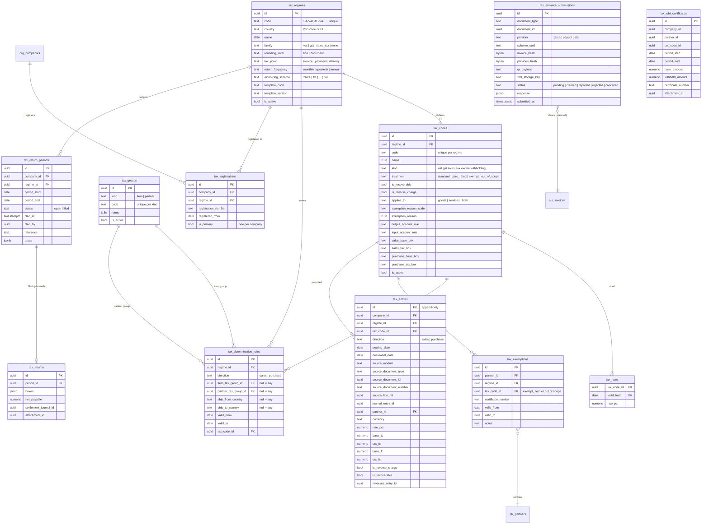
```mermaid
erDiagram
  tax_regimes ||--o{ tax_codes : "defines"
  tax_codes ||--|{ tax_rates : "rated"
  tax_regimes ||--o{ tax_determination_rules : "routes"
  tax_groups ||--o{ tax_determination_rules : "item group"
  tax_groups ||--o{ tax_determination_rules : "partner group"
  tax_codes ||--o{ tax_determination_rules : "yields"
  tax_regimes ||--o{ tax_registrations : "registered in"
  org_companies ||--o{ tax_registrations : "registers"
  tax_exemptions }o--|| ptr_partners : "certifies"
  tax_codes ||--o{ tax_exemptions : "exempt code"
  tax_codes ||--o{ tax_entries : "recorded"
  tax_regimes ||--o{ tax_return_periods : "periods"
  tax_return_periods ||--o| tax_returns : "filed (planned)"
  tax_einvoice_submissions }o--|| sls_invoices : "clears (planned)"

  tax_regimes {
    uuid id PK
    text code "SA-VAT AE-VAT ... unique"
    text country "ISO code or EU"
    i18n name
    text family "vat | gst | sales_tax | none"
    text rounding_level "line | document"
    text tax_point "invoice | payment | delivery"
    text return_frequency "monthly | quarterly | annual"
    text einvoicing_scheme "zatca | fta | ... | null"
    text template_code
    text template_version
    bool is_active
  }
  tax_codes {
    uuid id PK
    uuid regime_id FK
    text code "unique per regime"
    i18n name
    text kind "vat gst sales_tax excise withholding"
    text treatment "standard | zero_rated | exempt | out_of_scope"
    bool is_recoverable
    bool is_reverse_charge
    text applies_to "goods | services | both"
    text exemption_reason_code
    i18n exemption_reason
    text output_account_role
    text input_account_role
    text sales_base_box
    text sales_tax_box
    text purchase_base_box
    text purchase_tax_box
    bool is_active
  }
  tax_rates {
    uuid tax_code_id PK
    date valid_from PK
    numeric rate_pct
  }
  tax_groups {
    uuid id PK
    text kind "item | partner"
    text code "unique per kind"
    i18n name
    bool is_active
  }
  tax_determination_rules {
    uuid id PK
    uuid regime_id FK
    text direction "sales | purchase"
    uuid item_tax_group_id FK "null = any"
    uuid partner_tax_group_id FK "null = any"
    text ship_from_country "null = any"
    text ship_to_country "null = any"
    date valid_from
    date valid_to
    uuid tax_code_id FK
  }
  tax_registrations {
    uuid id PK
    uuid company_id FK
    uuid regime_id FK
    text registration_number
    date registered_from
    bool is_primary "one per company"
  }
  tax_exemptions {
    uuid id PK
    uuid partner_id FK
    uuid regime_id FK
    uuid tax_code_id FK "exempt, zero or out of scope"
    text certificate_number
    date valid_from
    date valid_to
    text notes
  }
  tax_entries {
    uuid id PK "append-only"
    uuid company_id FK
    uuid regime_id FK
    uuid tax_code_id FK
    text direction "sales | purchase"
    date posting_date
    date document_date
    text source_module
    text source_document_type
    uuid source_document_id
    text source_document_number
    uuid source_line_ref
    uuid journal_entry_id
    uuid partner_id FK
    text currency
    numeric rate_pct
    numeric base_tc
    numeric tax_tc
    numeric base_fc
    numeric tax_fc
    bool is_reverse_charge
    bool is_recoverable
    uuid reverses_entry_id
  }
  tax_return_periods {
    uuid id PK
    uuid company_id FK
    uuid regime_id FK
    date period_start
    date period_end
    text status "open | filed"
    timestamptz filed_at
    uuid filed_by
    text reference
    jsonb totals
  }
  tax_returns {
    uuid id PK
    uuid period_id FK
    jsonb boxes
    numeric net_payable
    uuid settlement_journal_id
    uuid attachment_id
  }
  tax_einvoice_submissions {
    uuid id PK
    text document_type
    uuid document_id
    text provider "zatca | peppol | eta"
    text scheme_uuid
    bytea invoice_hash
    bytea previous_hash
    text qr_payload
    text xml_storage_key
    text status "pending | cleared | reported | rejected | cancelled"
    jsonb response
    timestamptz submitted_at
  }
  tax_wht_certificates {
    uuid id PK
    uuid company_id
    uuid partner_id
    uuid tax_code_id
    date period_start
    date period_end
    numeric base_amount
    numeric withheld_amount
    text certificate_number
    uuid attachment_id
  }
```

Items (`itm_items.item_tax_group_id`, else the category's) and customer and supplier accounts (`tax_group_id`) point at tax groups of their kind. Withholding tax codes already live with the partners (`ptr_wht_codes`, M4).

## 13. Receivables and payables (subledgers and settlement)

```mermaid
erDiagram
  ar_open_items ||--o{ ar_settlements : "settled by"
  ar_open_items ||--o{ ar_settlements : "settles with"
  ar_open_items }o--|| ptr_customer_accounts : "owed by"
  ar_dunning_levels ||--o{ ar_dunning_letters : "produces"
  ar_dunning_runs ||--o{ ar_dunning_letters : "in run"
  ar_statements }o--|| ptr_customer_accounts : "for"
  ap_open_items ||--o{ ap_settlements : "settled by"
  ap_open_items }o--|| ptr_supplier_accounts : "owed to"
  ap_payment_proposals ||--|{ ap_payment_proposal_lines : "selects"
  ap_open_items ||--o{ ap_payment_proposal_lines : "proposed"
  netting_agreements ||--o{ netting_runs : "executes"

  ar_open_items {
    uuid id PK
    uuid company_id
    uuid customer_account_id FK
    text kind "invoice | credit_note | deposit | receipt_on_account | debit_adjustment | credit_adjustment | pdc | opening"
    text document_type
    uuid document_id
    text document_number
    date posting_date
    date document_date
    date due_date
    text currency
    numeric original_tc
    numeric original_fc
    numeric booked_rate
    numeric settled_tc
    numeric settled_fc
    numeric remaining_tc
    numeric remaining_fc "booked value of remaining"
    uuid journal_line_id
    uuid account_id "control account"
    uuid sales_rep_id
    uuid branch_id
    uuid dimension_set_id
    bool on_hold
    text hold_reason
    int dunning_level
    date promised_payment_date
    text status "open | partially_settled | settled | written_off"
  }
  ar_settlements {
    uuid id PK
    uuid company_id
    uuid settling_item_id FK "receipt, credit note, deposit"
    uuid settled_item_id FK "invoice"
    date settlement_date
    numeric amount_tc
    numeric settlement_rate
    numeric amount_fc_settling_item "at the settlement rate (was amount_fc_at_settlement)"
    numeric amount_fc_settled_item "at the booked rate (was amount_fc_booked)"
    numeric fx_gain_loss_fc
    numeric discount_taken_tc
    numeric wht_deducted_tc
    numeric write_off_tc
    numeric bank_charge_tc
    uuid journal_entry_id
    uuid reverses_settlement_id
    text kind "payment | credit_application | deposit_application | netting | write_off | revaluation"
  }
  ar_dunning_levels {
    uuid id PK
    uuid company_id
    int level
    int days_overdue
    i18n name
    uuid print_template_id
    numeric fee_amount
    bool block_customer
  }
  ar_dunning_runs {
    uuid id PK
    uuid company_id
    date run_date
    text status
    uuid run_by
  }
  ar_dunning_letters {
    uuid id PK
    uuid run_id FK
    uuid level_id FK
    uuid customer_account_id
    jsonb items
    uuid render_id
    timestamptz sent_at
  }
  ar_statements {
    uuid id PK
    uuid customer_account_id FK
    date from_date
    date to_date
    text currency
    numeric opening_balance
    numeric closing_balance
    uuid render_id
    timestamptz sent_at
  }
  ap_open_items {
    uuid id PK
    uuid company_id
    uuid supplier_account_id FK
    text kind "invoice | debit_note | advance | payment_on_account | adjustment | pdc | opening"
    text document_type
    uuid document_id
    text document_number
    text supplier_reference
    date posting_date
    date document_date
    date due_date
    date discount_date
    text currency
    numeric original_tc
    numeric original_fc
    numeric booked_rate
    numeric settled_tc
    numeric settled_fc
    numeric remaining_tc
    numeric remaining_fc
    uuid journal_line_id
    uuid account_id
    bool payment_blocked
    text block_reason "match_variance | hold | disputed"
    uuid branch_id
    uuid dimension_set_id
    text status
  }
  ap_settlements {
    uuid id PK
    uuid company_id
    uuid settling_item_id FK
    uuid settled_item_id FK
    date settlement_date
    numeric amount_tc
    numeric settlement_rate
    numeric amount_fc_at_settlement
    numeric amount_fc_booked
    numeric fx_gain_loss_fc
    numeric discount_taken_tc
    numeric wht_withheld_tc
    numeric write_off_tc
    numeric bank_charge_tc
    uuid journal_entry_id
    uuid reverses_settlement_id "a reversal is a mirror row with negative amounts"
    text kind
    text status "posted | reversed"
    text reason
  }
  ap_payment_proposals {
    uuid id PK
    uuid company_id
    date run_date
    date pay_through
    uuid bank_account_id
    text currency
    text status "draft | approved | executed"
    numeric total
  }
  ap_payment_proposal_lines {
    uuid proposal_id FK
    uuid open_item_id FK
    numeric amount_tc
    numeric discount_tc
    bool selected
    uuid payment_id
  }
  netting_agreements {
    uuid id PK
    uuid company_id
    uuid partner_id
    text frequency
    bool requires_approval
  }
  netting_runs {
    uuid id PK
    uuid agreement_id FK
    date run_date
    numeric ar_amount
    numeric ap_amount
    numeric net_amount
    uuid journal_entry_id
    text status
  }
```

### 13.1 Subledger reconciliation rule

`Σ remaining_fc` of open items for a control account at date D (computed from settlements with `settlement_date ≤ D`, plus revaluation settlements that are not yet auto-reversed at D) **equals** the control account's functional balance at D. Each settlement's `journal_entry_id` posts the cash, FX, discount, WHT, charge and write-off lines shown in POSTING_RULES §5 and §6. Aging at any date is computed from open items and settlements by date, never from a snapshot, so hard scenario 15 holds for any historical date.

## 14. Banking, cash, cheques, expense claims

```mermaid
erDiagram
  bnk_bank_accounts ||--o{ bnk_bank_transactions : "records"
  bnk_bank_accounts ||--o{ bnk_statements : "receives"
  bnk_statements ||--|{ bnk_statement_lines : "has"
  bnk_bank_accounts ||--o{ bnk_reconciliations : "reconciled"
  bnk_reconciliations ||--o{ bnk_reconciliation_matches : "matches"
  bnk_statement_lines ||--o{ bnk_reconciliation_matches : "matched"
  bnk_bank_transactions ||--o{ bnk_reconciliation_matches : "matched"
  bnk_reconciliation_rules ||--o{ bnk_reconciliation_matches : "auto"
  bnk_payments ||--|{ bnk_payment_lines : "allocates"
  bnk_payments ||--o| bnk_bank_transactions : "moves cash"
  bnk_payments ||--o| bnk_cheques : "by cheque"
  bnk_cheque_books ||--o{ bnk_cheques : "issues"
  bnk_cheques ||--|{ bnk_cheque_events : "history"
  bnk_deposits ||--o{ bnk_cheques : "deposits"
  bnk_petty_cash_funds ||--o{ bnk_petty_cash_vouchers : "spends"
  bnk_expense_claims ||--|{ bnk_expense_claim_lines : "has"
  bnk_transfers ||--o{ bnk_bank_transactions : "both sides"

  bnk_bank_accounts {
    uuid id PK
    uuid company_id
    text code
    i18n name
    text kind "bank | cash | petty_cash | clearing"
    text currency
    uuid gl_account_id
    uuid posting_group_id
    text bank_name
    text branch_name
    bytea account_number_enc
    text iban_masked
    text swift
    uuid branch_id
    numeric booked_fc_balance "for permanent revaluation"
    bool is_active
  }
  bnk_bank_transactions {
    uuid id PK
    uuid bank_account_id FK
    date posting_date
    date value_date
    text kind "receipt | disbursement | charge | interest | transfer_in | transfer_out | deposit | bounce | revaluation | opening"
    numeric amount_tc "signed"
    numeric amount_fc
    text reference
    text source_document_type
    uuid source_document_id
    uuid journal_line_id
    text reconciliation_status "unreconciled | matched | reconciled"
  }
  bnk_payment_methods {
    uuid id PK
    text code "CASH TRANSFER CHEQUE PDC CARD"
    i18n name
    text kind
    bool requires_cheque
    bool creates_pdc
  }
  bnk_payments {
    uuid id PK
    uuid company_id
    uuid branch_id
    text number
    text direction "receipt | disbursement"
    uuid partner_id
    uuid customer_account_id
    uuid supplier_account_id
    uuid payment_method_id FK
    uuid bank_account_id FK
    date posting_date
    date value_date
    text currency
    numeric amount_tc
    numeric exchange_rate
    numeric bank_rate "bank account currency"
    numeric bank_charge_tc
    numeric wht_tc
    text reference
    text status "draft | pending_approval | posted | void | reversed"
    uuid journal_entry_id
    uuid open_item_id "on-account remainder"
    uuid cheque_id
    jsonb custom_fields
  }
  bnk_payment_lines {
    uuid id PK
    uuid payment_id FK
    text line_kind "settle_ar | settle_ap | on_account | deposit | gl | charge | wht"
    uuid open_item_id
    uuid account_id
    numeric amount_tc
    numeric discount_tc
    numeric write_off_tc
    uuid dimension_set_id
    uuid settlement_id
  }
  bnk_statements {
    uuid id PK
    uuid bank_account_id FK
    text format "csv | ofx | mt940 | camt053 | manual"
    date from_date
    date to_date
    numeric opening_balance
    numeric closing_balance
    uuid attachment_id
    text status "imported | reconciling | reconciled"
  }
  bnk_statement_lines {
    uuid id PK
    uuid statement_id FK
    date booking_date
    date value_date
    numeric amount
    text description
    text counterparty
    text reference
    text bank_transaction_code
    text status "unmatched | matched | created"
  }
  bnk_reconciliations {
    uuid id PK
    uuid bank_account_id FK
    date as_of
    numeric statement_balance
    numeric book_balance
    numeric difference
    text status "open | completed"
    uuid completed_by
  }
  bnk_reconciliation_matches {
    uuid id PK
    uuid reconciliation_id FK
    uuid statement_line_id FK
    uuid bank_transaction_id FK
    uuid rule_id FK
    text match_kind "auto | manual | created"
    numeric confidence
  }
  bnk_reconciliation_rules {
    uuid id PK
    uuid company_id
    i18n name
    jsonb conditions "text patterns amount tolerance days"
    text action "match_open_item | post_to_account | match_transaction"
    uuid account_id
    int priority
  }
  bnk_cheque_books {
    uuid id PK
    uuid bank_account_id
    text prefix
    bigint first_number
    bigint last_number
    bigint next_number
  }
  bnk_cheques {
    uuid id PK
    uuid company_id
    text direction "received | issued"
    text cheque_number
    uuid cheque_book_id FK
    text drawer_bank
    text drawer_name
    uuid partner_id
    text currency
    numeric amount
    date issue_date
    date due_date
    bool is_post_dated
    text status "received | in_hand | deposited | cleared | bounced | returned_to_customer | issued | presented | paid | cancelled | replaced"
    uuid payment_id
    uuid deposit_id FK
    uuid bank_account_id
    uuid replaced_by_id
    uuid open_item_id
    jsonb custom_fields
  }
  bnk_cheque_events {
    uuid id PK
    uuid cheque_id FK
    timestamptz occurred_at
    text event "received deposited cleared bounced redeposited returned issued presented paid cancelled"
    date effective_date
    numeric bank_charge
    numeric customer_fee
    text reason
    uuid journal_entry_id
    uuid actor
  }
  bnk_deposits {
    uuid id PK
    uuid company_id
    text number
    uuid bank_account_id
    date deposit_date
    numeric total
    text status "prepared | deposited | cleared | partially_bounced"
    uuid journal_entry_id
  }
  bnk_petty_cash_funds {
    uuid id PK
    uuid company_id
    uuid branch_id
    uuid bank_account_id "kind petty_cash"
    uuid custodian_membership_id
    numeric float_amount
    text currency
  }
  bnk_petty_cash_vouchers {
    uuid id PK
    uuid fund_id FK
    text number
    date posting_date
    text kind "expense | replenishment | return"
    numeric amount
    uuid account_id
    uuid tax_code_id
    uuid dimension_set_id
    uuid attachment_id
    text status
    uuid journal_entry_id
  }
  bnk_expense_claims {
    uuid id PK
    uuid company_id
    uuid employee_partner_id
    text number
    date claim_date
    text currency
    numeric total
    text status "draft | submitted | approved | posted | paid | rejected"
    uuid approval_request_id
    uuid journal_entry_id
    uuid ap_open_item_id
  }
  bnk_expense_claim_lines {
    uuid claim_id FK
    date expense_date
    uuid account_id
    text description
    numeric amount
    text currency
    uuid tax_code_id
    uuid dimension_set_id
    uuid attachment_id
    text policy_check
  }
  bnk_transfers {
    uuid id PK
    uuid company_id
    text number
    uuid from_bank_account_id
    uuid to_bank_account_id
    date posting_date
    numeric amount_from
    numeric amount_to
    numeric rate
    numeric charges
    text status "draft | in_transit | completed"
    uuid journal_entry_id
  }
```

Post-dated cheque life cycle (hard scenario 10): `received` (customer balance reduced, PDC receivable up) → `deposited` at maturity (cheques-under-collection clearing) → `cleared` (bank) or `bounced` (customer balance restored via a new AR open item referencing the original invoice, bank charge posted, optional fee re-charged to the customer, cheque status `bounced`, history in `bnk_cheque_events`). Issued cheques mirror this on the AP side.

## 15. Fixed assets

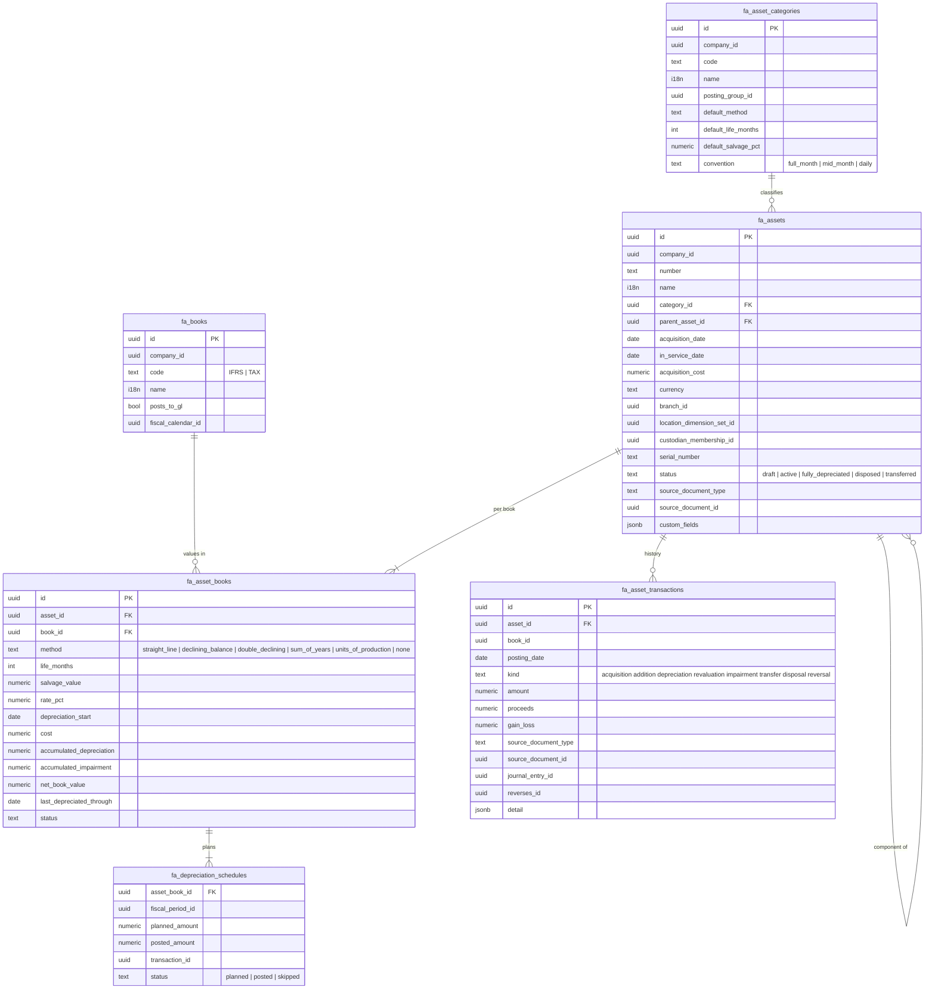
```mermaid
erDiagram
  fa_asset_categories ||--o{ fa_assets : "classifies"
  fa_books ||--o{ fa_asset_books : "values in"
  fa_assets ||--|{ fa_asset_books : "per book"
  fa_asset_books ||--|{ fa_depreciation_schedules : "plans"
  fa_assets ||--o{ fa_asset_transactions : "history"
  fa_assets ||--o{ fa_assets : "component of"

  fa_asset_categories {
    uuid id PK
    uuid company_id
    text code
    i18n name
    uuid posting_group_id
    text default_method
    int default_life_months
    numeric default_salvage_pct
    text convention "full_month | mid_month | daily"
  }
  fa_books {
    uuid id PK
    uuid company_id
    text code "IFRS | TAX"
    i18n name
    bool posts_to_gl
    uuid fiscal_calendar_id
  }
  fa_assets {
    uuid id PK
    uuid company_id
    text number
    i18n name
    uuid category_id FK
    uuid parent_asset_id FK
    date acquisition_date
    date in_service_date
    numeric acquisition_cost
    text currency
    uuid branch_id
    uuid location_dimension_set_id
    uuid custodian_membership_id
    text serial_number
    text status "draft | active | fully_depreciated | disposed | transferred"
    text source_document_type
    uuid source_document_id
    jsonb custom_fields
  }
  fa_asset_books {
    uuid id PK
    uuid asset_id FK
    uuid book_id FK
    text method "straight_line | declining_balance | double_declining | sum_of_years | units_of_production | none"
    int life_months
    numeric salvage_value
    numeric rate_pct
    date depreciation_start
    numeric cost
    numeric accumulated_depreciation
    numeric accumulated_impairment
    numeric net_book_value
    date last_depreciated_through
    text status
  }
  fa_depreciation_schedules {
    uuid asset_book_id FK
    uuid fiscal_period_id
    numeric planned_amount
    numeric posted_amount
    uuid transaction_id
    text status "planned | posted | skipped"
  }
  fa_asset_transactions {
    uuid id PK
    uuid asset_id FK
    uuid book_id
    date posting_date
    text kind "acquisition addition depreciation revaluation impairment transfer disposal reversal"
    numeric amount
    numeric proceeds
    numeric gain_loss
    text source_document_type
    uuid source_document_id
    uuid journal_entry_id
    uuid reverses_id
    jsonb detail
  }
```

`fa_asset_transactions` is the FA subledger (append-only): net book value per book = Σ transactions; the FA control accounts (cost, accumulated depreciation) must equal Σ over assets at any date.

## 16. Budgeting

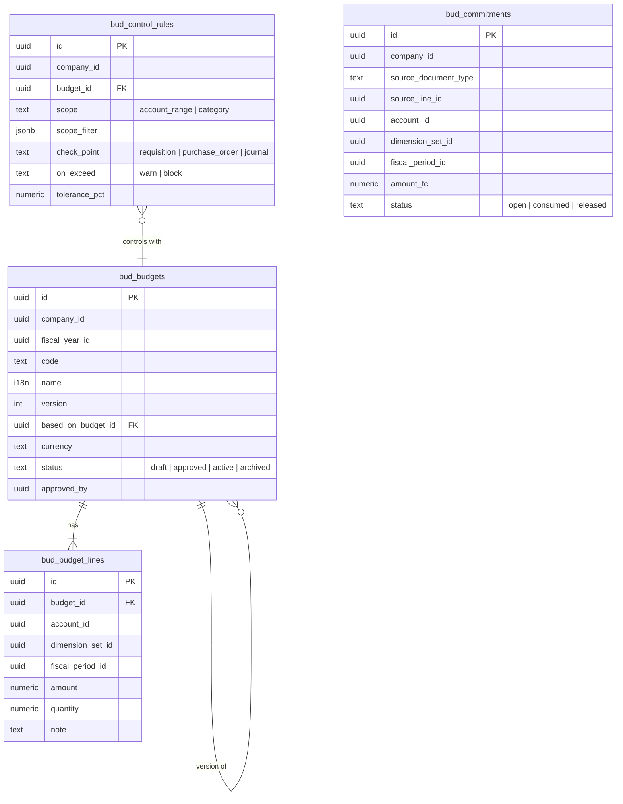
```mermaid
erDiagram
  bud_budgets ||--|{ bud_budget_lines : "has"
  bud_budgets ||--o{ bud_budgets : "version of"
  bud_control_rules }o--|| bud_budgets : "controls with"

  bud_budgets {
    uuid id PK
    uuid company_id
    uuid fiscal_year_id
    text code
    i18n name
    int version
    uuid based_on_budget_id FK
    text currency
    text status "draft | approved | active | archived"
    uuid approved_by
  }
  bud_budget_lines {
    uuid id PK
    uuid budget_id FK
    uuid account_id
    uuid dimension_set_id
    uuid fiscal_period_id
    numeric amount
    numeric quantity
    text note
  }
  bud_control_rules {
    uuid id PK
    uuid company_id
    uuid budget_id FK
    text scope "account_range | category"
    jsonb scope_filter
    text check_point "requisition | purchase_order | journal"
    text on_exceed "warn | block"
    numeric tolerance_pct
  }
  bud_commitments {
    uuid id PK
    uuid company_id
    text source_document_type
    uuid source_line_id
    uuid account_id
    uuid dimension_set_id
    uuid fiscal_period_id
    numeric amount_fc
    text status "open | consumed | released"
  }
```

## 17. Intercompany and consolidation

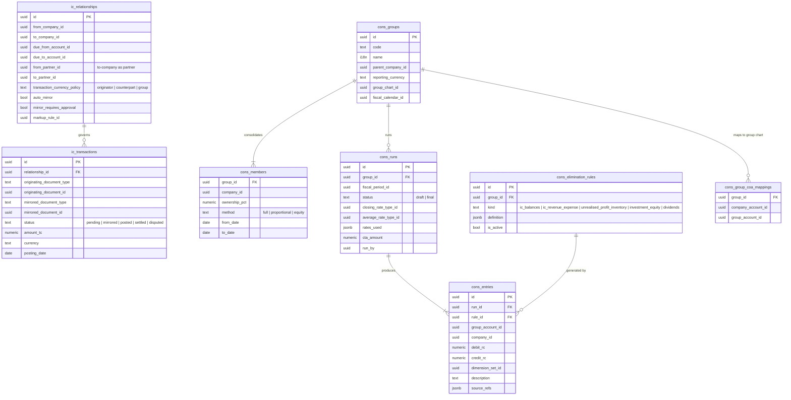
```mermaid
erDiagram
  ic_relationships ||--o{ ic_transactions : "governs"
  cons_groups ||--|{ cons_members : "consolidates"
  cons_groups ||--o{ cons_runs : "runs"
  cons_runs ||--|{ cons_entries : "produces"
  cons_elimination_rules ||--o{ cons_entries : "generated by"
  cons_groups ||--o{ cons_group_coa_mappings : "maps to group chart"

  ic_relationships {
    uuid id PK
    uuid from_company_id
    uuid to_company_id
    uuid due_from_account_id
    uuid due_to_account_id
    uuid from_partner_id "to-company as partner"
    uuid to_partner_id
    text transaction_currency_policy "originator | counterpart | group"
    bool auto_mirror
    bool mirror_requires_approval
    uuid markup_rule_id
  }
  ic_transactions {
    uuid id PK
    uuid relationship_id FK
    text originating_document_type
    uuid originating_document_id
    text mirrored_document_type
    uuid mirrored_document_id
    text status "pending | mirrored | posted | settled | disputed"
    numeric amount_tc
    text currency
    date posting_date
  }
  cons_groups {
    uuid id PK
    text code
    i18n name
    uuid parent_company_id
    text reporting_currency
    uuid group_chart_id
    uuid fiscal_calendar_id
  }
  cons_members {
    uuid group_id FK
    uuid company_id
    numeric ownership_pct
    text method "full | proportional | equity"
    date from_date
    date to_date
  }
  cons_runs {
    uuid id PK
    uuid group_id FK
    uuid fiscal_period_id
    text status "draft | final"
    uuid closing_rate_type_id
    uuid average_rate_type_id
    jsonb rates_used
    numeric cta_amount
    uuid run_by
  }
  cons_elimination_rules {
    uuid id PK
    uuid group_id FK
    text kind "ic_balances | ic_revenue_expense | unrealised_profit_inventory | investment_equity | dividends"
    jsonb definition
    bool is_active
  }
  cons_entries {
    uuid id PK
    uuid run_id FK
    uuid rule_id FK
    uuid group_account_id
    uuid company_id
    numeric debit_rc
    numeric credit_rc
    uuid dimension_set_id
    text description
    jsonb source_refs
  }
  cons_group_coa_mappings {
    uuid group_id FK
    uuid company_account_id
    uuid group_account_id
  }
```

Consolidation entries live in the group's own ledger (`cons_entries`), never in a company's GL. The consolidated statements = translated member balances + `cons_entries`; the currency translation adjustment is computed and stored per run (hard scenario 8).

## 18. Closing: checklists, FX revaluation, year-end

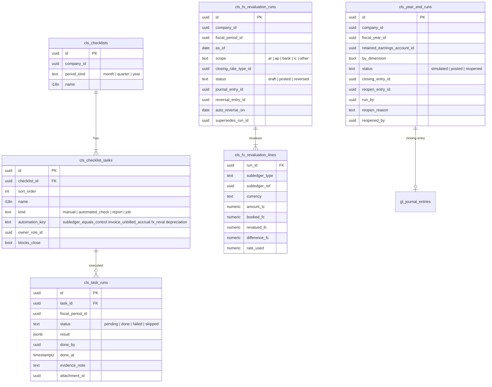
```mermaid
erDiagram
  cls_checklists ||--|{ cls_checklist_tasks : "has"
  cls_checklist_tasks ||--o{ cls_task_runs : "executed"
  cls_fx_revaluation_runs ||--|{ cls_fx_revaluation_lines : "revalues"
  cls_year_end_runs ||--o| gl_journal_entries : "closing entry"

  cls_checklists {
    uuid id PK
    uuid company_id
    text period_kind "month | quarter | year"
    i18n name
  }
  cls_checklist_tasks {
    uuid id PK
    uuid checklist_id FK
    int sort_order
    i18n name
    text kind "manual | automated_check | report | job"
    text automation_key "subledger_equals_control invoice_unbilled_accrual fx_reval depreciation"
    uuid owner_role_id
    bool blocks_close
  }
  cls_task_runs {
    uuid id PK
    uuid task_id FK
    uuid fiscal_period_id
    text status "pending | done | failed | skipped"
    jsonb result
    uuid done_by
    timestamptz done_at
    text evidence_note
    uuid attachment_id
  }
  cls_fx_revaluation_runs {
    uuid id PK
    uuid company_id
    uuid fiscal_period_id
    date as_of
    text scope "ar | ap | bank | ic | other"
    uuid closing_rate_type_id
    text status "draft | posted | reversed"
    uuid journal_entry_id
    uuid reversal_entry_id
    date auto_reverse_on
    uuid supersedes_run_id
  }
  cls_fx_revaluation_lines {
    uuid run_id FK
    text subledger_type
    uuid subledger_ref
    text currency
    numeric amount_tc
    numeric booked_fc
    numeric revalued_fc
    numeric difference_fc
    numeric rate_used
  }
  cls_year_end_runs {
    uuid id PK
    uuid company_id
    uuid fiscal_year_id
    uuid retained_earnings_account_id
    bool by_dimension
    text status "simulated | posted | reopened"
    uuid closing_entry_id
    uuid reopen_entry_id
    uuid run_by
    text reopen_reason
    uuid reopened_by
  }
```

## 19. Workflow and approvals

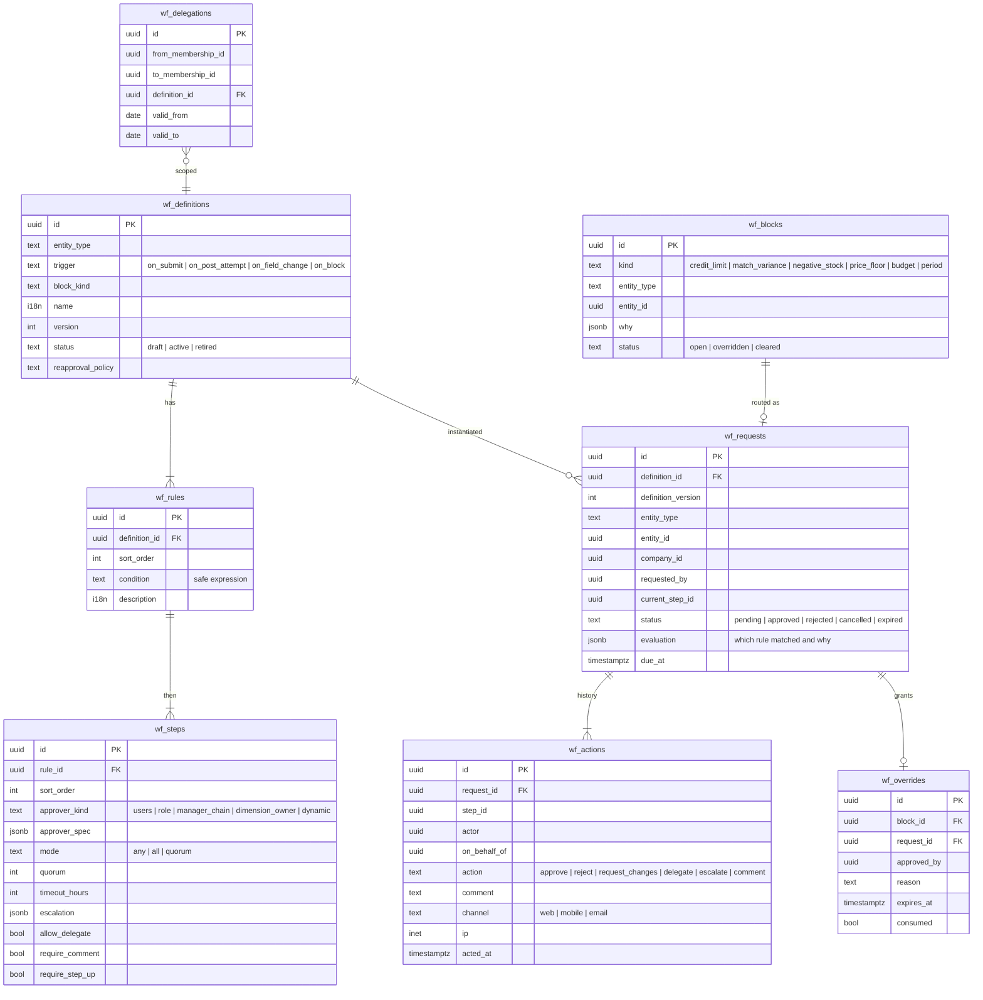
```mermaid
erDiagram
  wf_definitions ||--|{ wf_rules : "has"
  wf_rules ||--|{ wf_steps : "then"
  wf_definitions ||--o{ wf_requests : "instantiated"
  wf_requests ||--|{ wf_actions : "history"
  wf_blocks ||--o| wf_requests : "routed as"
  wf_requests ||--o| wf_overrides : "grants"
  wf_delegations }o--|| wf_definitions : "scoped"

  wf_definitions {
    uuid id PK
    text entity_type
    text trigger "on_submit | on_post_attempt | on_field_change | on_block"
    text block_kind
    i18n name
    int version
    text status "draft | active | retired"
    text reapproval_policy
  }
  wf_rules {
    uuid id PK
    uuid definition_id FK
    int sort_order
    text condition "safe expression"
    i18n description
  }
  wf_steps {
    uuid id PK
    uuid rule_id FK
    int sort_order
    text approver_kind "users | role | manager_chain | dimension_owner | dynamic"
    jsonb approver_spec
    text mode "any | all | quorum"
    int quorum
    int timeout_hours
    jsonb escalation
    bool allow_delegate
    bool require_comment
    bool require_step_up
  }
  wf_requests {
    uuid id PK
    uuid definition_id FK
    int definition_version
    text entity_type
    uuid entity_id
    uuid company_id
    uuid requested_by
    uuid current_step_id
    text status "pending | approved | rejected | cancelled | expired"
    jsonb evaluation "which rule matched and why"
    timestamptz due_at
  }
  wf_actions {
    uuid id PK
    uuid request_id FK
    uuid step_id
    uuid actor
    uuid on_behalf_of
    text action "approve | reject | request_changes | delegate | escalate | comment"
    text comment
    text channel "web | mobile | email"
    inet ip
    timestamptz acted_at
  }
  wf_blocks {
    uuid id PK
    text kind "credit_limit | match_variance | negative_stock | price_floor | budget | period"
    text entity_type
    uuid entity_id
    jsonb why
    text status "open | overridden | cleared"
  }
  wf_overrides {
    uuid id PK
    uuid block_id FK
    uuid request_id FK
    uuid approved_by
    text reason
    timestamptz expires_at
    bool consumed
  }
  wf_delegations {
    uuid id PK
    uuid from_membership_id
    uuid to_membership_id
    uuid definition_id FK
    date valid_from
    date valid_to
  }
```

## 20. Integration, jobs and search

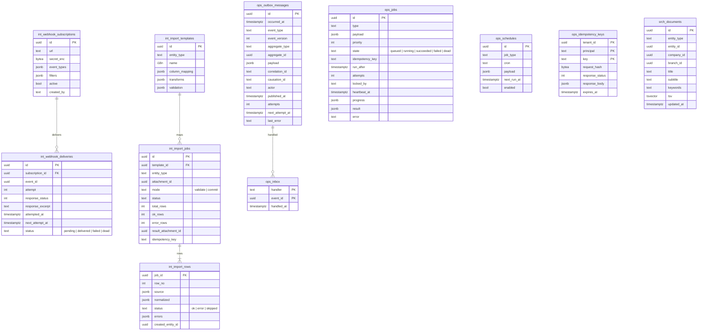
```mermaid
erDiagram
  int_webhook_subscriptions ||--o{ int_webhook_deliveries : "delivers"
  int_import_templates ||--o{ int_import_jobs : "maps"
  int_import_jobs ||--|{ int_import_rows : "rows"
  ops_outbox_messages ||--o{ ops_inbox : "handled"

  int_webhook_subscriptions {
    uuid id PK
    text url
    bytea secret_enc
    jsonb event_types
    jsonb filters
    bool active
    text created_by
  }
  int_webhook_deliveries {
    uuid id PK
    uuid subscription_id FK
    uuid event_id
    int attempt
    int response_status
    text response_excerpt
    timestamptz attempted_at
    timestamptz next_attempt_at
    text status "pending | delivered | failed | dead"
  }
  int_import_templates {
    uuid id PK
    text entity_type
    i18n name
    jsonb column_mapping
    jsonb transforms
    jsonb validation
  }
  int_import_jobs {
    uuid id PK
    uuid template_id FK
    text entity_type
    uuid attachment_id
    text mode "validate | commit"
    text status
    int total_rows
    int ok_rows
    int error_rows
    uuid result_attachment_id
    text idempotency_key
  }
  int_import_rows {
    uuid job_id FK
    int row_no
    jsonb source
    jsonb normalized
    text status "ok | error | skipped"
    jsonb errors
    uuid created_entity_id
  }
  ops_outbox_messages {
    uuid id PK
    timestamptz occurred_at
    text event_type
    int event_version
    text aggregate_type
    uuid aggregate_id
    jsonb payload
    text correlation_id
    text causation_id
    text actor
    timestamptz published_at
    int attempts
    timestamptz next_attempt_at
    text last_error
  }
  ops_inbox {
    text handler PK
    uuid event_id PK
    timestamptz handled_at
  }
  ops_jobs {
    uuid id PK
    text type
    jsonb payload
    int priority
    text state "queued | running | succeeded | failed | dead"
    text idempotency_key
    timestamptz run_after
    int attempts
    text locked_by
    timestamptz heartbeat_at
    jsonb progress
    jsonb result
    text error
  }
  ops_schedules {
    uuid id PK
    text job_type
    text cron
    jsonb payload
    timestamptz next_run_at
    bool enabled
  }
  ops_idempotency_keys {
    uuid tenant_id PK
    text principal PK
    text key PK
    bytea request_hash
    int response_status
    jsonb response_body
    timestamptz expires_at
  }
  srch_documents {
    uuid id PK
    text entity_type
    uuid entity_id
    uuid company_id
    uuid branch_id
    text title
    text subtitle
    text keywords
    tsvector tsv
    timestamptz updated_at
  }
```

## 21. Reporting, print and onboarding

```mermaid
erDiagram
  rpt_models ||--|{ rpt_fields : "exposes"
  rpt_models ||--o{ rpt_reports : "queried by"
  rpt_reports ||--o{ rpt_report_shares : "shared"
  rpt_reports ||--o{ rpt_schedules : "scheduled"
  rpt_schedules ||--o{ rpt_runs : "produced"
  rpt_dashboards ||--|{ rpt_dashboard_widgets : "shows"
  rpt_reports ||--o{ rpt_dashboard_widgets : "backs"
  rpt_financial_layouts ||--|{ rpt_layout_rows : "rows"
  rpt_financial_layouts ||--|{ rpt_layout_columns : "columns"
  prt_templates ||--|{ prt_template_versions : "versioned"
  prt_template_versions ||--o{ prt_renders : "rendered"
  onb_industry_templates ||--o{ onb_config_bundles : "packaged"

  rpt_models {
    uuid id PK
    text code "journal_lines sales_lines stock_value open_items"
    i18n name
    text fact_table
    jsonb joins
    jsonb security_predicates
    bool is_system
  }
  rpt_fields {
    uuid id PK
    uuid model_id FK
    text key
    i18n label
    text role "dimension | measure"
    text data_type
    text aggregation
    text expression
    text folder
    jsonb drill_path
    text custom_field_key
    bool is_system
  }
  rpt_reports {
    uuid id PK
    uuid model_id FK
    i18n name
    uuid owner_membership_id
    jsonb definition "rows cols values filters calcs comparisons params"
    text kind "table | pivot | chart | financial"
    uuid layout_id
    bool is_template
  }
  rpt_report_shares {
    uuid report_id FK
    text share_with "role | membership | tenant"
    uuid target_id
    text access "view | edit"
  }
  rpt_schedules {
    uuid id PK
    uuid report_id FK
    text cron
    jsonb parameters
    jsonb recipients
    text format "pdf | xlsx | csv"
    bool only_if_rows
    bool enabled
  }
  rpt_runs {
    uuid id PK
    uuid schedule_id FK
    uuid report_id
    uuid run_as_membership_id
    timestamptz started_at
    int row_count
    uuid attachment_id
    text status
  }
  rpt_dashboards {
    uuid id PK
    i18n name
    uuid owner_membership_id
    jsonb layout
    text sharing
    bool is_template
  }
  rpt_dashboard_widgets {
    uuid id PK
    uuid dashboard_id FK
    uuid report_id FK
    text viz "kpi | line | bar | pie | table | gauge"
    jsonb options
    int refresh_seconds
  }
  rpt_financial_layouts {
    uuid id PK
    uuid company_id
    text kind "pl | bs | cashflow | tb | management"
    i18n name
    bool is_template
  }
  rpt_layout_rows {
    uuid layout_id FK
    int sort_order
    text row_type "header | accounts | category | formula | total | blank"
    i18n label
    jsonb account_filter
    jsonb dimension_filter
    text formula
    bool flip_sign
    int indent
    bool bold
  }
  rpt_layout_columns {
    uuid layout_id FK
    int sort_order
    text column_type "period | ytd | prior_period | prior_year | budget | variance | variance_pct | custom_range"
    i18n label
    jsonb parameters
    text currency_mode "functional | reporting | transaction"
  }
  prt_templates {
    uuid id PK
    text document_type
    i18n name
    text language_mode "en | ar | bilingual"
    text paper "A4 | Letter | label"
    uuid company_id
    uuid branch_id
    bool is_default
  }
  prt_template_versions {
    uuid id PK
    uuid template_id FK
    int version
    text html
    text css
    jsonb sample_data
    uuid published_by
    timestamptz published_at
  }
  prt_renders {
    uuid id PK
    uuid template_version_id FK
    text document_type
    uuid document_id
    int document_version
    text storage_key
    bytea sha256
    timestamptz rendered_at
  }
  onb_setup_progress {
    uuid company_id PK
    jsonb steps "wizard step states"
    text industry_template_code
    timestamptz completed_at
  }
  onb_industry_templates {
    text code PK
    i18n name
    text description
    jsonb contents "chart roles dimensions tax series print reports"
  }
  onb_config_bundles {
    uuid id PK
    text source "template | export"
    text template_code FK
    uuid attachment_id
    jsonb manifest
    uuid imported_by
  }
```

### 21.1 Reporting schema (read models)

| Fact table | Grain | Key measures | Drill keys |
|------------|-------|--------------|------------|
| `fact_journal_lines` | journal line | debit/credit tc, fc, rc | entry id, line id, source document |
| `fact_sales_lines` | invoice/credit line | quantity, net, tax, gross, cost (from linked value entries), margin, discount by rule | invoice line id, shipment line id, order line id |
| `fact_purchase_lines` | supplier invoice line | quantity, net, tax, landed cost share, price variance | invoice line id, receipt line id, PO line id |
| `fact_stock_movements` | stock ledger entry | quantity, value, entry type | SLE id, source document |
| `fact_stock_value` | value entry | cost amount actual/expected by value type | SVE id, adjustment run |
| `fact_open_items` | open item × settlement | original, settled, remaining, days overdue at query date | open item id, settlement id |
| `fact_payments` | payment line | amount, discount, FX, charges | payment id |
| `fact_budget_lines` | budget line | amount by version | budget id |
| `fact_assets` | asset transaction | cost, depreciation, NBV | asset id |

Dimensions: `dim_date` (with fiscal period per company), `dim_company`, `dim_branch`, `dim_account` (hierarchy path, category, statement), `dim_partner`, `dim_item` (category path, brand), `dim_warehouse`, `dim_sales_rep`, `dim_currency`, `dim_dimension_values` (one row per dimension value with path), `dim_custom_<key>` generated for reportable custom fields.

## 22. Intelligence (AI)

```mermaid
erDiagram
  ai_settings ||--o{ ai_interactions : "governs"
  ai_interactions ||--o{ ai_feedback : "rated"
  ai_findings }o--|| ai_settings : "under"
  ai_capture_jobs ||--o| pur_invoices : "drafts"

  ai_settings {
    uuid tenant_id PK
    text provider "claude | local | disabled"
    text model
    jsonb enabled_features
    bool data_sharing_consent
    int retention_days
  }
  ai_interactions {
    uuid id PK
    uuid membership_id
    text feature "ask | anomaly | forecast | capture"
    text input
    jsonb tool_calls
    jsonb output
    jsonb semantic_query
    text model
    text prompt_version
    int tokens_in
    int tokens_out
    int latency_ms
  }
  ai_feedback {
    uuid interaction_id FK
    int rating
    text comment
    jsonb correction
  }
  ai_findings {
    uuid id PK
    text kind "duplicate_invoice | unusual_margin | suspicious_journal | price_outlier | dormant_supplier"
    text entity_type
    uuid entity_id
    numeric score
    jsonb evidence
    text status "open | confirmed | dismissed"
    uuid reviewed_by
  }
  ai_capture_jobs {
    uuid id PK
    uuid attachment_id
    text status
    jsonb extracted
    jsonb field_confidence
    uuid matched_supplier_id
    uuid matched_po_id
    uuid draft_invoice_id
  }
  ai_forecasts {
    uuid id PK
    uuid company_id
    uuid item_id
    uuid warehouse_id
    text method
    jsonb horizon
    numeric mape
    timestamptz generated_at
  }
```

## 23. Cross-module invariants (the model's contract)

1. Every posted document has exactly one `journal_entry_id` (or a reversal pair), and every journal entry points back to its source document.
2. Every control-account journal line references a subledger row of the matching type, and every subledger row references its journal line.
3. Σ open items remaining (fc) = control account balance (fc), per company, currency, date.
4. Σ stock value entries = inventory GL balance, per company, posting group, date; Σ stock ledger quantities = `inv_stock_balances`.
5. Σ FA transactions = FA control accounts; bank transactions = bank GL accounts; outstanding cheques = PDC control accounts.
6. Document chains: for every downstream line, Σ linked quantity ≤ source line quantity; `qty_shipped`, `qty_invoiced`, `qty_received` on source lines equal Σ links.
7. Dimension sets on journal lines satisfy each account's dimension rules.
8. Every row carries `tenant_id`; every foreign key is tenant-composite; every table has RLS.
9. Gapless series contain no missing numbers among posted documents.
10. The audit hash chain verifies from genesis to head.

These are the checks the invariant harness runs (ADR-0029).
